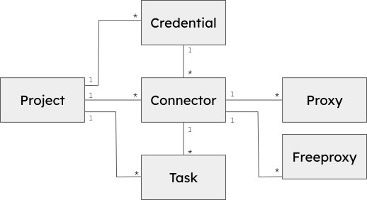
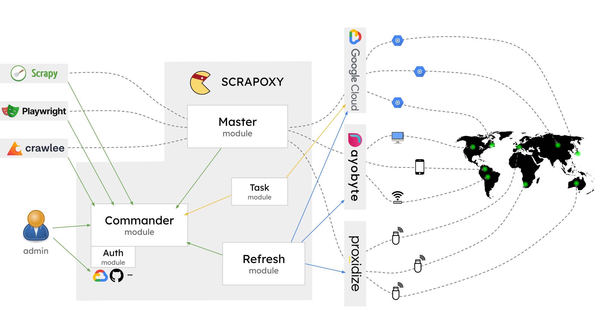

# Architecture Overview

## Model

Before we dive into the architecture, let's define some **keys concepts**.

Scrapoxy data model has Projects, Credentials, Connectors, Proxies, Freeproxies and Tasks.

### Project 🏗️

The project serves as the foundation of the data model, encompassing all other elements. 

A user can have multiple projects.

### Credential 🔑

Credential stores **authentication** information for a connector.
It can be employed in multiple connectors, allowing for duplicated configurations without replicating credentials.

For instance, a user may have two AWS connectors in different regions using the same credentials.

### Connector 🔌

A connector is a **provider**. They are different sorts of connectors:
for cloud provider, for proxy services, for hardware provider, and free proxies list.

Each connector has a type, which defines how proxies are retrieved.

### Proxy 🌐

A proxy represents an endpoint to which requests are sent for the final website.

Proxies can vary based on the connector type and may include VM instances, simple proxies, 4G mobile dongles, or free proxies.

### Freeproxy 🌐

A freeproxy is a manual proxy exclusively available for the `Free proxies List` connector.

It shares similarities with the proxy concept but is manually managed.

### Task 📆

A task corresponds to an installation or uninstallation task for a cloud connector.

## Modules

### Master module 🚗

The master module is responsible for **routing** requests to connectors and proxies.

It includes a **transport** module that defines protocol implementations.

### Commander module 🎓

The commander module serves as the central entry point for Scrapoxy. 
It operates as an API communicating with storage modules to store data.

All modules interact with the commander module to access data.

Additionally, the commander hosts the User Interface through the frontend module.

### Refresh modules 🔄

There are various types of refresh modules:

- **Refresh Connectors**: This module calls connectors' APIs (AWS, Azure, etc.) to retrieve proxies' information.
- **Refresh Proxies**: This module pings or fingerprints proxies to obtain their status.
- **Refresh Task**: This module executes installation tasks for cloud connectors.

## Internal Architecture

### Scraper 🕸️

When a scraper intends to collect data from a website,
it sends a request to the master module (port 8888).

Based on the `Proxy-Authorization` header, 
the master module determines the utilized project and queries the commander module for the configuration.

Subsequently, the master module routes the request to the connector endpoint using the correct transport.

### Connectors and Proxies status 🔌

Periodically, the refresh module queries the connector to update the list of proxies. 

On cloud providers, Scrapoxy instructs the start or removal of VM instances.

Additionally, Scrapoxy leverages the master module to query [fingerprint.scrapoxy.io](https://fingerprint.scrapoxy.io) to obtain proxies' status. 
This server provides details such as the real IP address, geo-localization, and other information about the proxy.

## Storage 

The storage module operates on the commander, serving the crucial function of storing data.

Two types of storage are supported: file storage and distributed storage.

### File Storage 📙

In file storage, data is stored within a **single file**. 

While this storage solution is not designed to be distributed among multiple instances,
it offers a quick and straightforward setup with efficient performance.

### Distributed Storage ⭐

Distributed storage, on the other hand, utilizes [MongoDB](https://www.mongodb.com) 
and follows a Command Query Responsibility Segregation ([CQRS](https://en.wikipedia.org/wiki/Command_Query_Responsibility_Segregation)) pattern. 

[RabbitMQ](https://www.rabbitmq.com) plays a pivotal role in dispatching commands and events to the storage module,
facilitating the management of data across a distributed environment.

This approach enables **scalability** and enhanced data handling capabilities.
