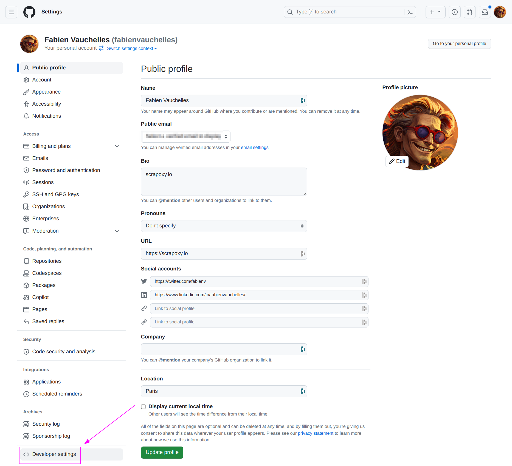

# Github Authentication

{width=230}

[GitHub](https://github.com) is a web-based platform that enables developers to store and manage
their source code repositories,


## Github Settings

Connect to [Settings](https://github.com/settings).

### Create new credential



On the left menu, click on `Developer settings`.

---


1. Click on `OAuth Apps`;
2. And click on `New OAuth App`.

---


1. Enter `Scrapoxy` as Application name;
2. Enter your app URL as Homepage URL;
3. Enter `http://localhost:8890/api/users/auths/github` as Authorization callback URL;
4. Click on `Register application`.

::: tip
Replace `http://localhost:8890` by the URL of your Scrapoxy instance and keep the `/api/users/auths/github` path.
:::

---


1. Remember the Client ID;
2. Click on `Generate a new client secret`;

---


Remember the Client secret.


## Scrapoxy

Add 2 environment variables to your Scrapoxy instance:

```shell
export AUTH_GITHUB_CLIENT_ID=<client_id>
export AUTH_GITHUB_CLIENT_SECRET=<client_secret>
```

Replace `<client_id>` and `<client_secret>` by the values you copied earlier.

Based on this environment values, Scrapoxy will automatically bootstrap the Github authentication.

::: info
Adapt the command to your environment (Docker, Kubernetes, etc.).
:::

And restart your Scrapoxy instance with Github Authentication:


