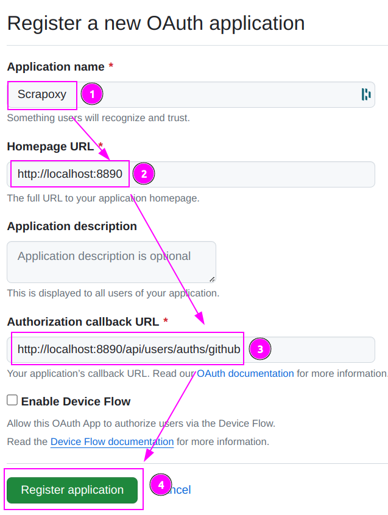
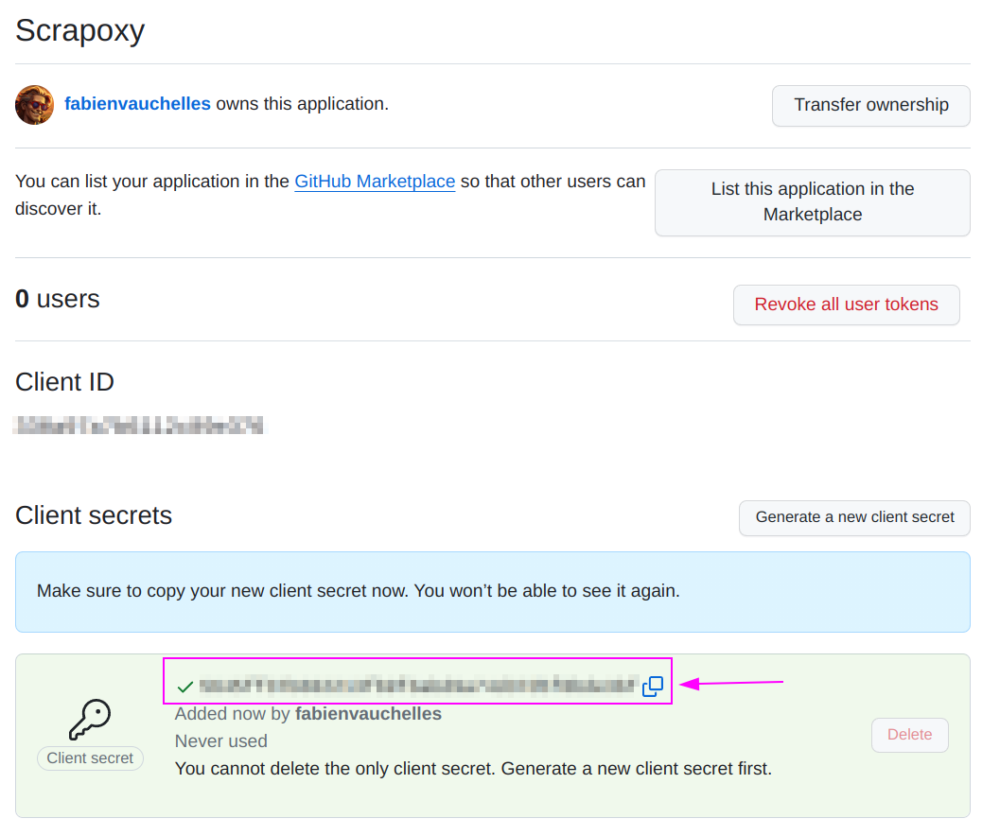
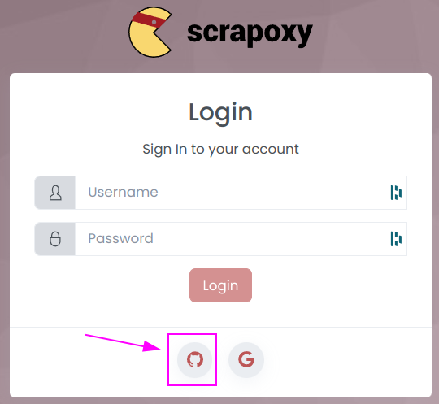

# Github Authentication

{width=230}

[GitHub](https://github.com) is a web-based platform that enables developers to store and manage
their source code repositories,


## Github Settings

Connect to [Settings](https://github.com/settings).

### Create new credential


On the left menu, click on `Developer settings`.

---


1. Click on `OAuth Apps`;
2. And click on `New OAuth App`.

---



1. Enter `Scrapoxy` as Application name;
2. Enter your app URL as Homepage URL;
3. Enter `http://localhost:8890/api/users/auths/github` as Authorization callback URL (replace `http://localhost:8890` by the **external URL** of your Scrapoxy instance);
4. Click on `Register application`.


---


1. Remember the Client ID;
2. Click on `Generate a new client secret`;

---



Remember the Client secret.


## Scrapoxy

### With Docker

Open the **terminal** and run the following command:

```shell
docker run -d -p 8888:8888 -p 8890:8890 -e FRONTEND_URL=http://localhost:8890 -e AUTH_GITHUB_CLIENT_ID=my_client_id -e AUTH_GITHUB_CLIENT_SECRET=my_client_secret -e BACKEND_JWT_SECRET=secret1 -e FRONTEND_JWT_SECRET=secret2 fabienvauchelles/scrapoxy
```

Replace:
- `my_client_id` and `my_client_secret` with the values you copied earlier;
- `http://localhost:8890` by the external URL of your Scrapoxy instance.

Scrapoxy will automatically bootstrap the Github authentication:




### With NPM

### On Linux

Open the **terminal** and run the following command:

```shell
FRONTEND_URL=http://localhost:8890 AUTH_GITHUB_CLIENT_ID=my_client_id AUTH_GITHUB_CLIENT_SECRET=my_client_secret BACKEND_JWT_SECRET=secret1 FRONTEND_JWT_SECRET=secret2 npx --yes scrapoxy
```

Replace:
- `my_client_id` and `my_client_secret` with the values you copied earlier;
- `http://localhost:8890` by the external URL of your Scrapoxy instance.


### On Windows

Open the **Command Prompt** and run the following command:

```shell
set FRONTEND_URL=http://localhost:8890
set AUTH_GITHUB_CLIENT_ID=my_client_id
set AUTH_GITHUB_CLIENT_SECRET=my_client_secret
set BACKEND_JWT_SECRET=secret1
set FRONTEND_JWT_SECRET=secret2
npx --yes scrapoxy
```

Replace:
- `my_client_id` and `my_client_secret` with the values you copied earlier;
- `http://localhost:8890` by the external URL of your Scrapoxy instance.
