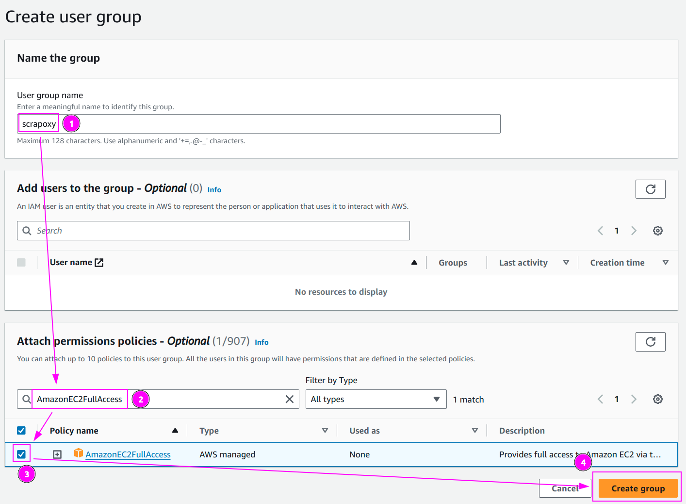
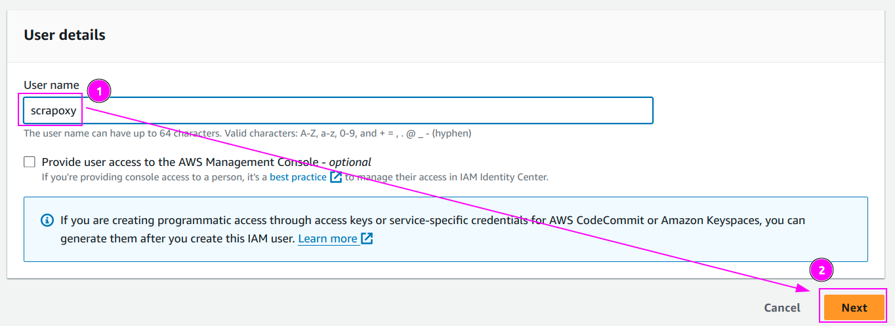
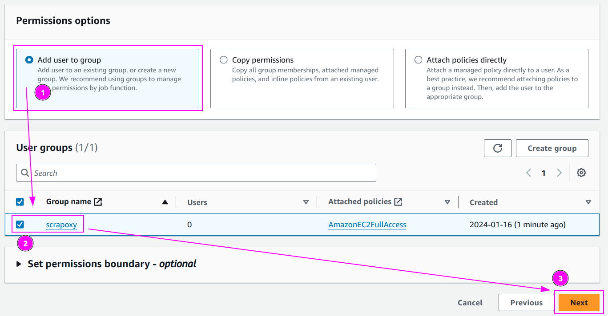
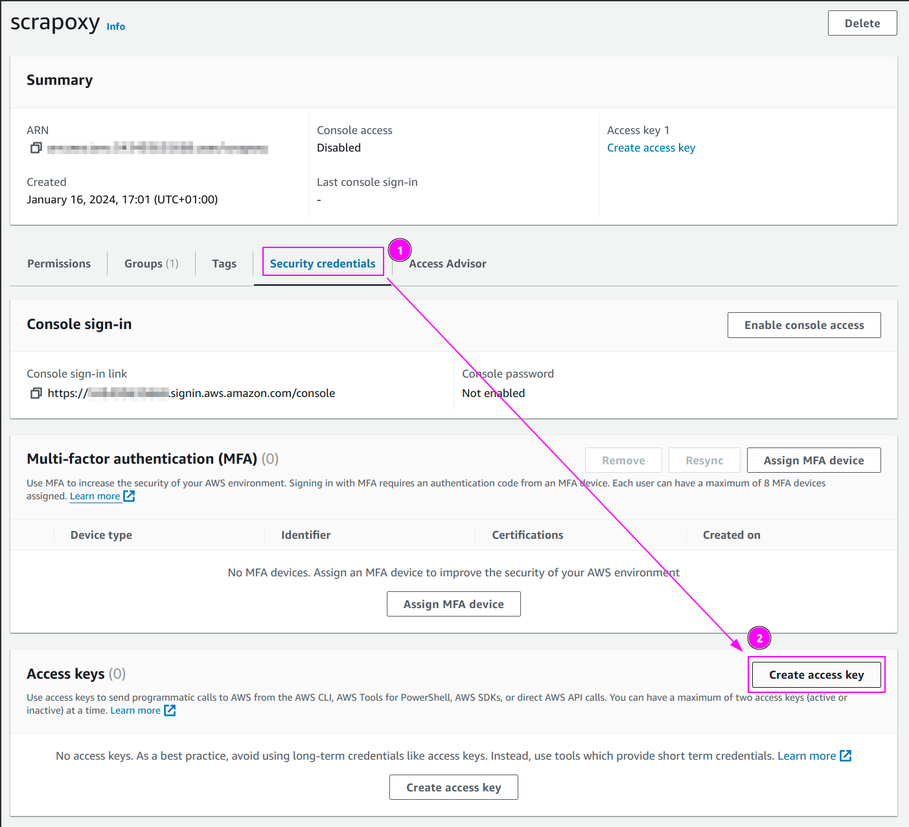
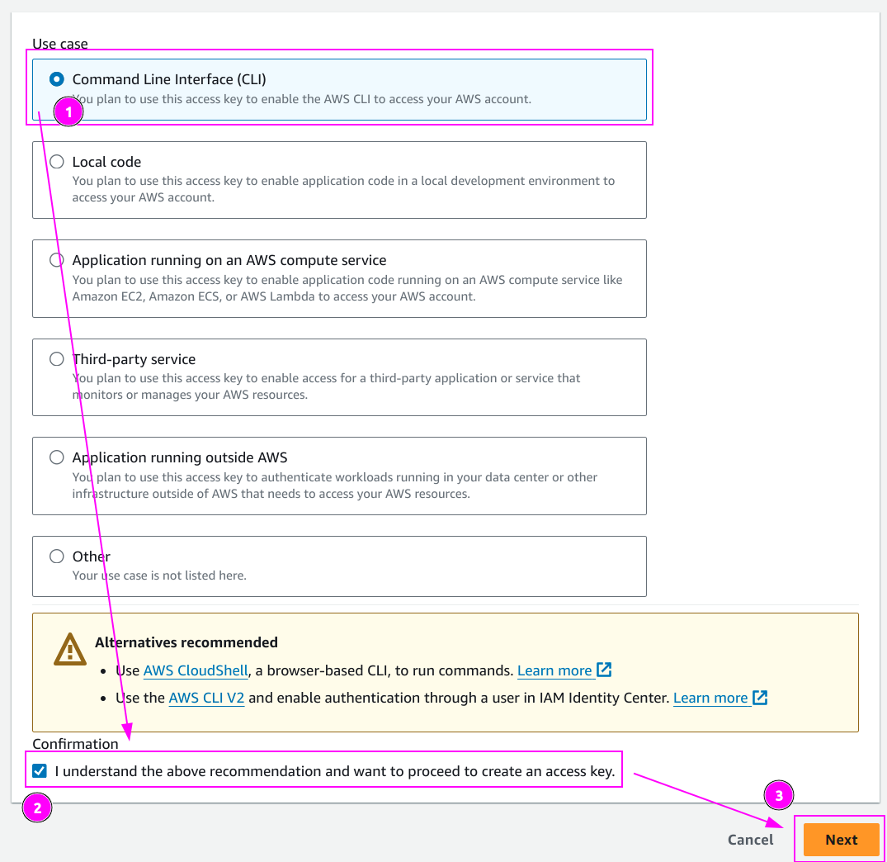
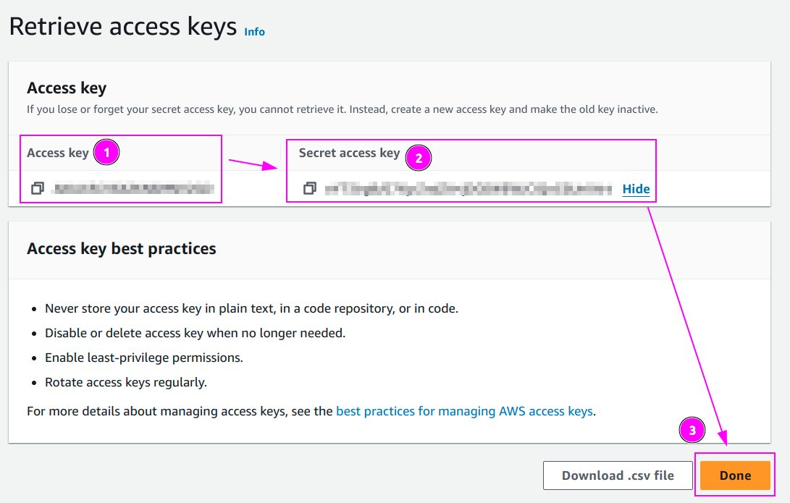
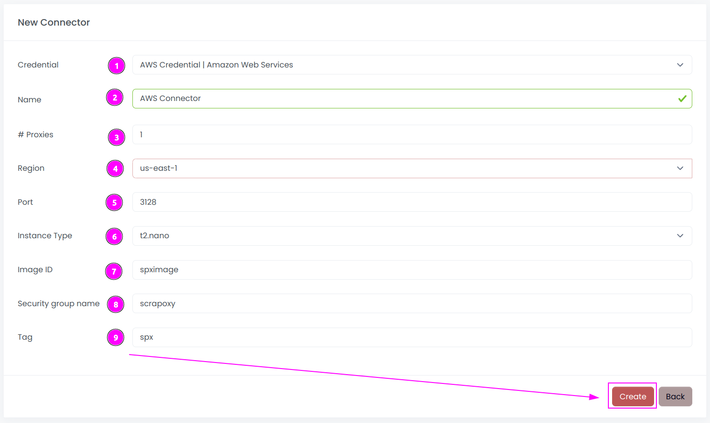

# Amazon Web Services Connector

{width=150, nozoom}

[Amazon Web Services](/l/aws) is a subsidiary of Amazon that provides on-demand cloud computing.

## Prerequisites

An active subscription to Amazon Web Services (AWS) is required.

## AWS Console

Connect to [AWS Console](/l/aws-console).

There are 2 methods for generating a new credential with AWS:

1. With an IAM user, a more secure approach albeit with increased complexity.
2. With the Root user, which is easier but not recommended for security reasons.

## With an IAM user

This is the recommended method for generating a new credential with AWS.

1. On the top right, click on your name to open the menu;
2. And click on `Security credentials`.

---

1. On the left, click on `User groups`;
2. And click on `Create group`.

---

1. Enter `scrapoxy` as group name;
2. Search for `AmazonEC2FullAccess`;
3. Select it;
4. And click on `Create group`.

---

1. On the left, click on `Users`;
2. And click on `Create user`.

---

1. Enter `scrapoxy` as user name;
2. And click on `Next`.

---

1. Select `Add user to group`;
2. Select `scrapoxy` as group;
3. And click on `Next`.

---

Click on `Create user`.

---

Click on the user `scrapoxy`.

---

1. Select `Security credentials` tab;
2. And click on `Create access key`.

---

1. Select `Command Line Interface (CLI)`;
2. Check the confirmation box;
3. And click on `Next`.

---

Click on `Create access key`.

---

1. Remember the `Access key`;
2. Remember the `Secret access key`;
3. And click on `Done`.

## With the Root user

This method is not recommended for security reasons.

1. On the top right, click on your name to open the menu;
2. And click on `Security credentials`.

---

Click on `Create access key`.

---

1. Check the box;
2. And click on `Create access key`.

---

Remember the `Access key ID` and the `Secret access key` values.

## Scrapoxy

Open Scrapoxy User Interface and select `Marketplace`:

### Step 1: Create a new credential

Select `AWS` to create a new credential (use search if necessary).

---

Complete the form by entering the following information:
1. **Name**: Specify the unique name for the credential;
2. **Access key ID**: Provide the Access Key ID associated with the account;
3. **Secret access key**: Enter the Client Secret associated with the account.

And click on `Create`.

### Step 2: Create a new connector

Create a new connector:

Complete the form with the following information:
1. **Credential**: The previous credential;
2. **Name**: The name of the connector;
3. **# Proxies**: The number of instances to create;
4. **Region**: The region where the instances will be created;
5. **Port**: The port of the proxy (on AWS). If it is modified after installation, the security group must also be updated to allow traffic on the new port;
6. **Instance Type**: The type of the instance;
7. **Image ID**: The name of the image in the region;
8. **Security group name**: The name of the security group containing the firewall rules;
9. **Tag**: The default tag for instance.

And click on `Create`.

Most default values can be retained if suitable for the use case.

::: warning
When setting up the connector in multiple regions, assign a unique **Image ID** and distinct **Tag** for each region. 
Without this, connectors may interfere with each other, shutting down instances from the same provider.
:::

### Step 3: Install the connector

On the connector list, click on `Install`.

---

Click on `Install`.

Scrapoxy will start, install and stop the VM to create a custom image.

::: warning
Do not reuse an installation from a prior setup:
Scrapoxy embeds a unique TLS certificate within the instance image to secure communication and communication with the Master will fail.
:::

---

When the installation is finished, click on `Connectors`.

---

1. Start the project;
2. Start the connector.

### Other: Uninstall the connector

1. Stop the connector;
2. Wait for proxies to be removed.

---

On the connector list, click on `Uninstall`.

---

Confirm the uninstallation.

Wait for the uninstallation to finish: Scrapoxy will delete the custom image.
