# Microsoft Azure Connector

{width=230, nozoom}

[Microsoft Azure](https://azure.microsoft.com) is a cloud computing service created by Microsoft.

## Prerequisites

An active Microsoft Azure subscription is required.

## Azure Portal

Connect to [Azure Portal](https://portal.azure.com).

### Step 1: Register a new application

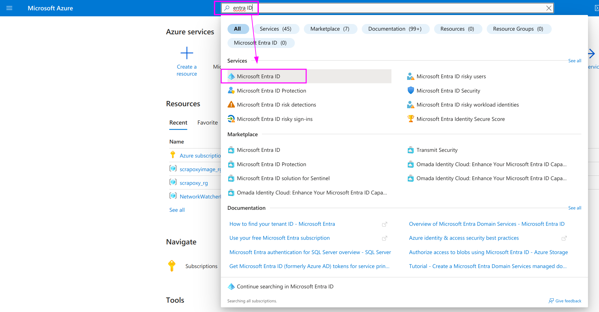

Search the Microsoft Entra ID (aka Active Directory).

---

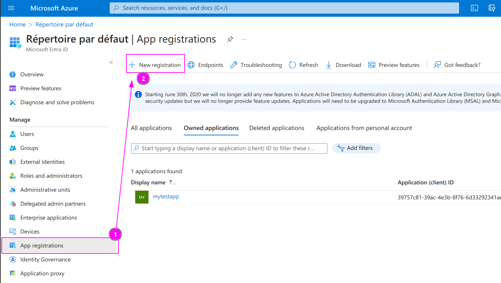

1. Click on `App registrations`;
2. And click `New registration`.

---

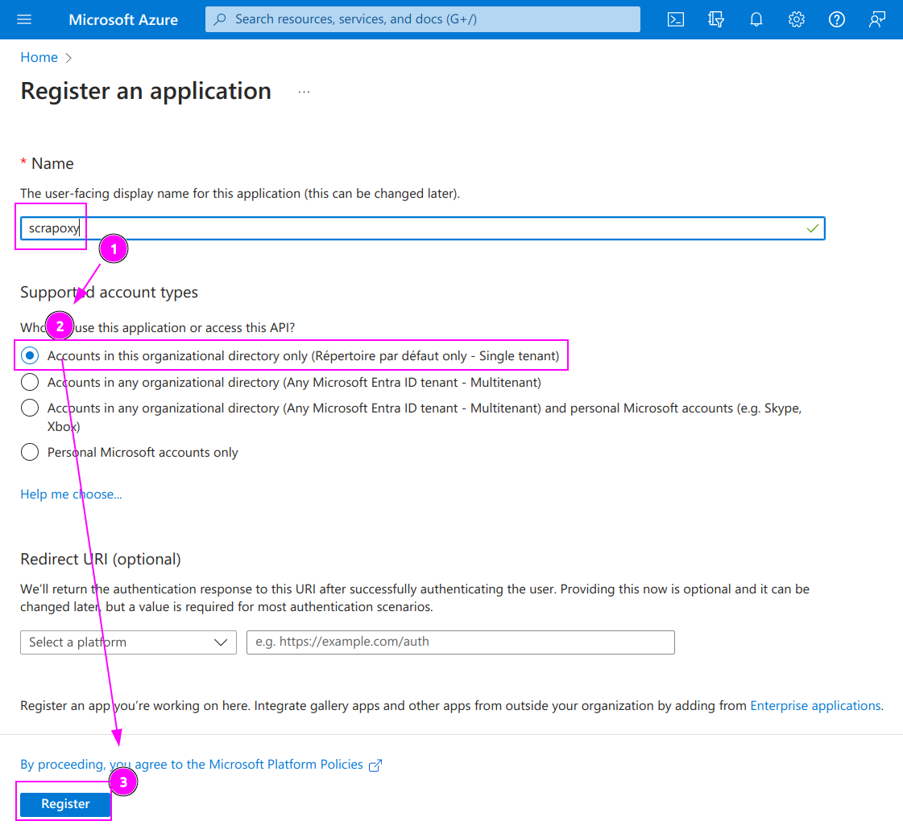

Complete the form with the following information:
- Name: `scrapoxy`
- Supported account types: `Accounts in this organizational directory only (Microsoft only - Single tenant)`

And click on `Register`.

---

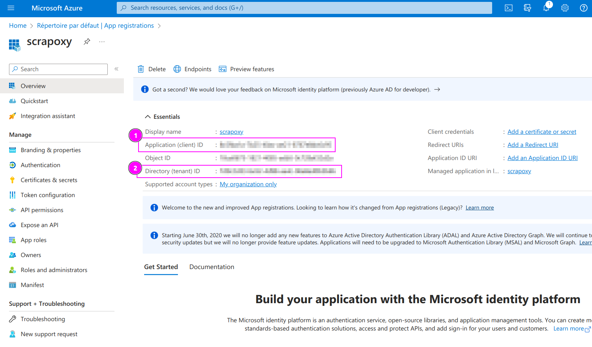

Remember:
1. the `Application (client) ID`;
2. and the `Directory (tenant) ID`.

### Step 2: Create a client secret

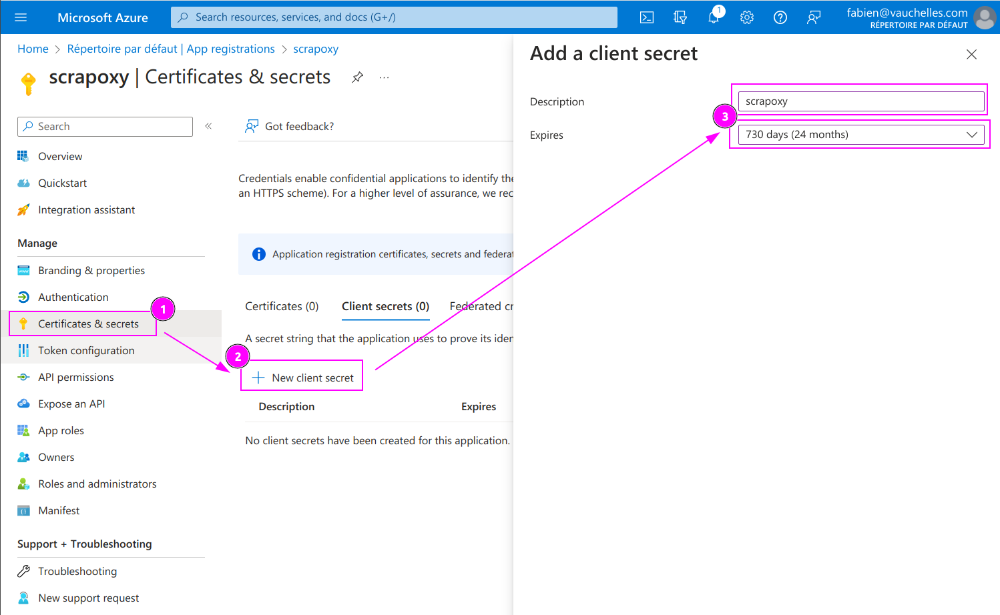

1. Click on `Certificates & secrets`;
2. Click on `New client secret`;
3. Enter a description, select the maximum expiration time;
4. Click on `Add`.

---

Remember the `Value` of the secret.

### Step 3: Get your subscription ID

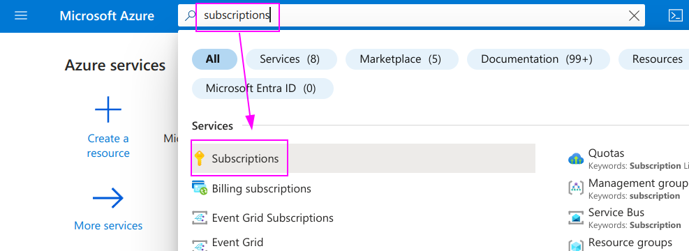

Search the Subscription.

---

Select the first subscription.

---

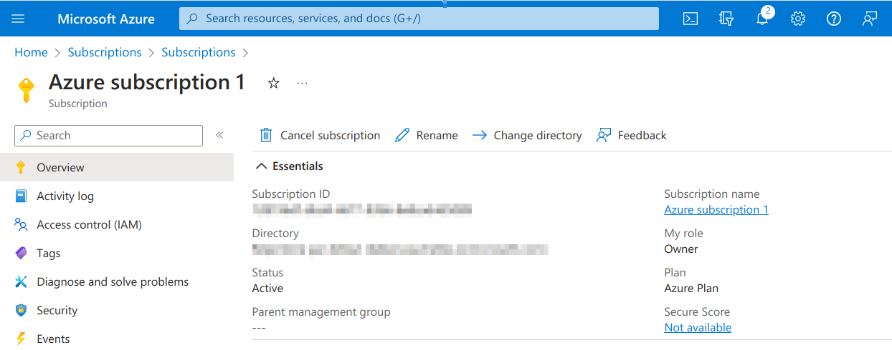

Remember the `Subscription ID` value.

### Step 4: Add a role to the application

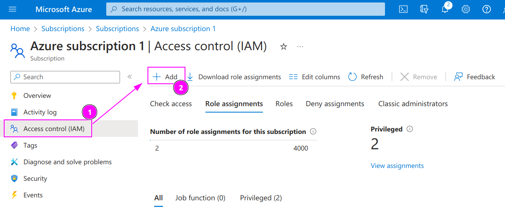

On the subscription:
1. Click on `Access control (IAM)`;
2. And click on `Add`.

---

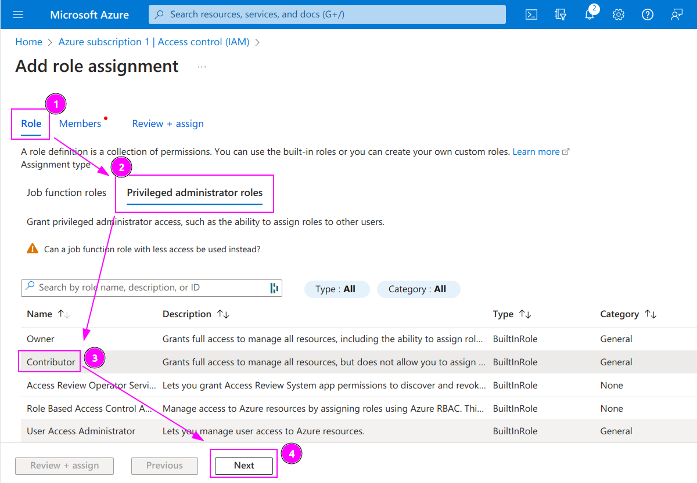

1. On tab `Role`;
2. Select `Privileged administrator roles`;
3. Select `Contributor`;
4. Click on `Next`.

---

1. On tab `Members`;
2. Click on `Select members`;
3. Select the application you created;
4. Click on `Select`:

---

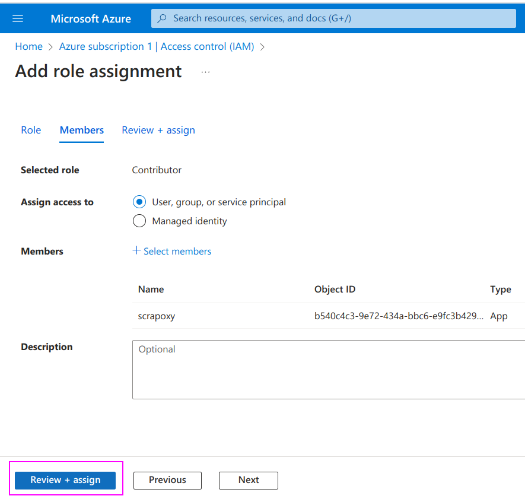

Finally, click on `Review + assign` 2 times.

## Scrapoxy

Open Scrapoxy User Interface and select `Marketplace`:

### Step 1: Create a new credential

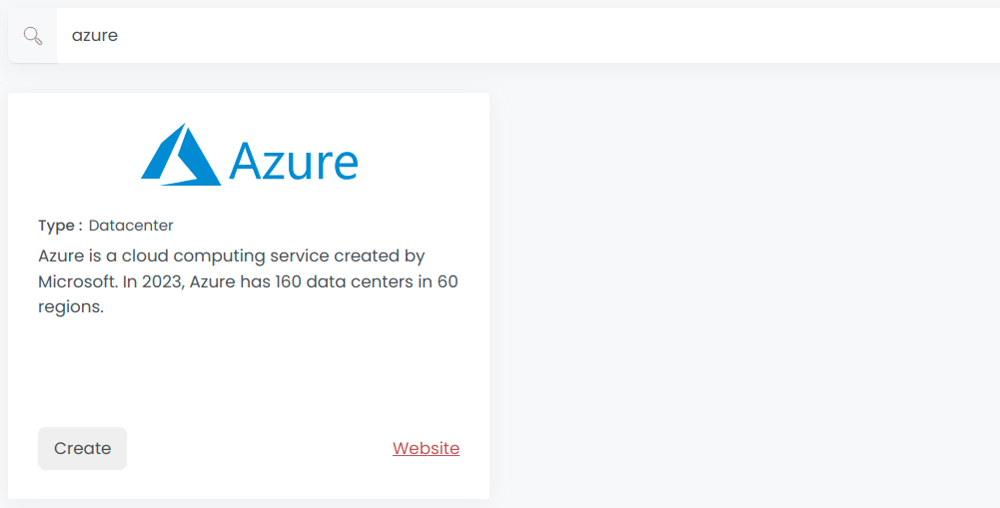

Select `Azure` to create a new credential (use search if necessary).

---

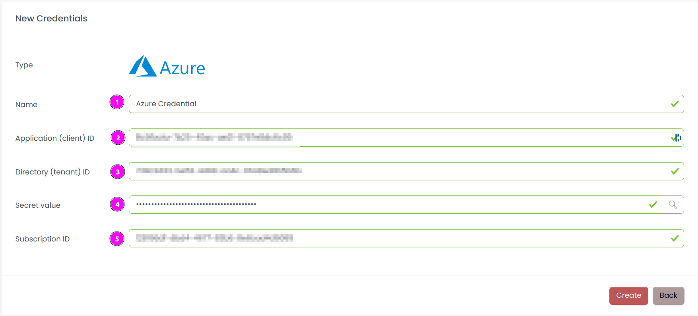

Complete the form with the following information:
1. **Name**: The name of the credential;
2. **Application (client) ID**: The Application ID (aka Client ID) of the application;
3. **Directory (tenant) ID**: The Directory ID (aka Tenant ID) of the application;
4. **Secret value**: The Client Secret of the application;
5. **Subscription ID**: The Subscription ID.

And click on `Create`.

### Step 2: Create a new connector

Create a new connector:

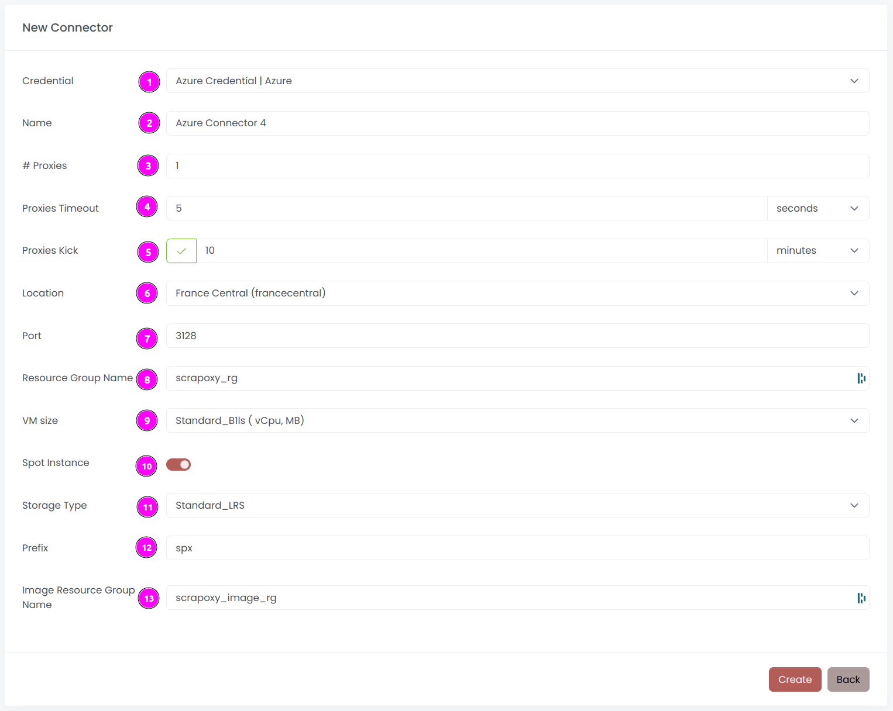

Complete the form with the following information:
1. **Credential**: The previous credential;
2. **Name**: The name of the connector;
3. **# Proxies**: The number of instances to create;
4. **Location**: The region where the instances will be created;
5. **Port**: The port of the proxy (on Azure);
6. **Resource Group Name**: The resource group to host the instances;
7. **VM size**: The size of the VM;
8. **Storage Type**: The type of storage;
9. **Prefix**: The prefix for all resources created on Azure;
10. **Image Resource Group Name**: The resource group where the image is stored.

And click on `Create`.

::: tip
You can retain most of the default values if they are suitable for your use case.
:::

### Step 3: Install the connector

On the connector list, click on `Install`.

---

Click on `Install`.

Scrapoxy will start, install and stop the VM to create a custom image.

---

When the installation is finished, click on `Connectors`.

---

1. Start the project;
2. Start the connector.

### Other: Uninstall the connector

1. Stop the connector;
2. Wait for proxies to be removed.

---

On the connector list, click on `Uninstall`.

---

Confirm the uninstallation.

Wait for the uninstallation to finish: Scrapoxy will delete the custom image.
