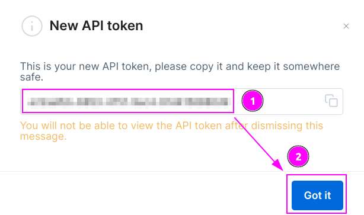
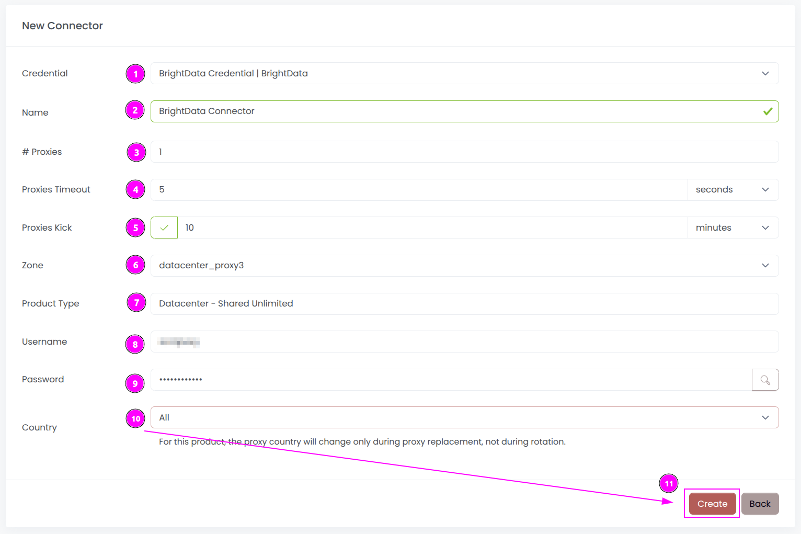

# Bright Data Connector

{width=280 nozoom}

[Bright Data](https://get.brightdata.com/khkl3keb25ld) provides award-winning proxy networks, AI-powered web scrapers, 
and business-ready datasets for download. Welcome to the internet’s most trusted web data platform.

::: info
This connector supports Datacenter and ISP proxies, 
with plans to integrate Residential and Mobile proxies in the future.
:::

## Prerequisites

An active Bright Data subscription is required.

## Bright Data Dashboard

Connect to [Dashboard](https://brightdata.com/cp).

### Create a token

1. On the left menu, select the wheel at the bottom;
2. Click on `Account settings`.

---

Click on `Add token`.

---

1. Select the `Ops` permissions;
2. Click on `Unlimited` or specify a date for a limited token if wanted;
3. Click on `Save`.

---

1. Remember the token;
2. and click on `Got it`.

## Scrapoxy

Open Scrapoxy User Interface and select `Marketplace`:

### Step 1: Create a new credential

Select `Brightdata` to create a new credential (use search if necessary).

---

Complete the form with the following information:
1. **Name**: The name of the credential;
2. **Token**: The token.

And click on `Create`.

### Step 2: Create a new connector

Create a new connector and select `BrightData` as provider:

Complete the form with the following information:
1. **Credential**: The previous credential;
2. **Name**: The name of the connector;
3. **# Proxies**: The number of instances to create;
4. **Proxies Timeout**: Maximum duration for connecting to a proxy before considering it as offline;
5. **Proxies Kick**: If enabled, maximum duration for a proxy to be offline before being removed from the pool;
6. **Zone**: The zone to use.

And click on `Create`.

### Step 3: Start the connector

1. Start the project;
2. Start the connector.

### Step 4: Interact with proxies

Within this connector, you can perform 2 actions on the proxies:
1. **Trash button**: Initiates a proxy rotation. The session is temporarily removed and will be reused later.
2. **Cross button**: Requests a replacement from BrightData to permanently replace the IP, which comes with associated costs.

### Other: Stop the connector

1. Stop the connector;
2. Wait for proxies to be removed.
