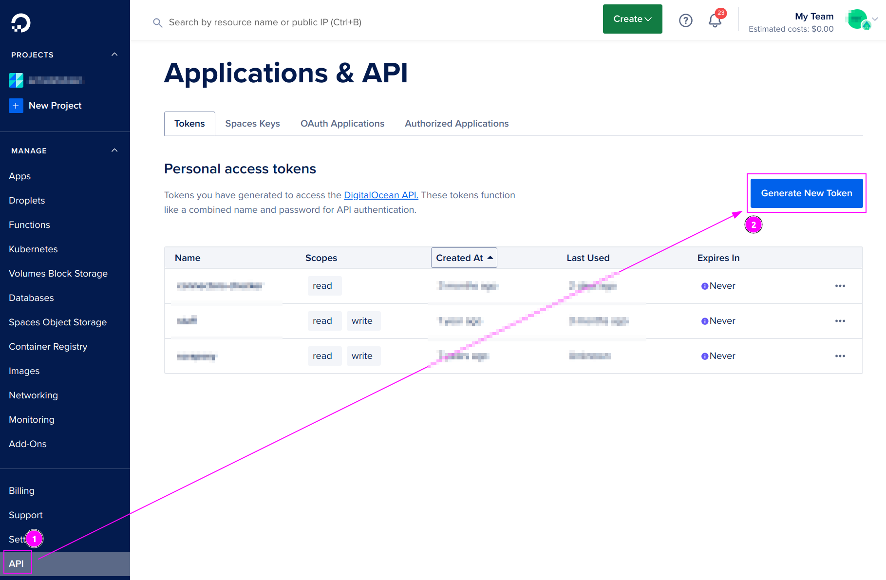
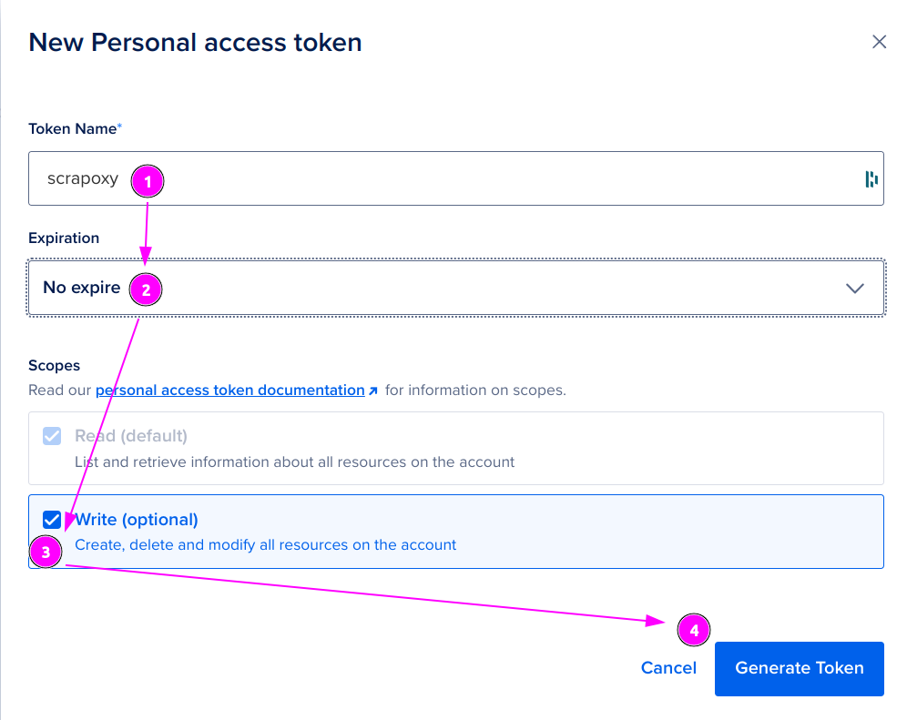
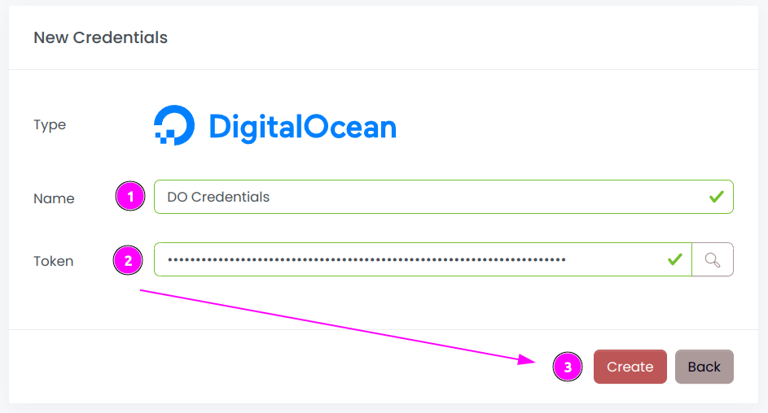

# Digital Ocean Connector

{width=280 nozoom}

[Digital Ocean](https://digitalocean.com) is an US multinational cloud provider.

## Prerequisites

An active Digital Ocean subscription is required.

## Digital Ocean Admin

Connect to [Admin](https://cloud.digitalocean.com).

### Create new credential

On the left menu, click on `API` and click on `Generate New Token`.

---

1. Enter `scrapoxy` as Token name;
2. Select `No expire` for Expiration;
3. Check the `Write` box on Scopes
4. And click on `Generate Token`.

---

Remember the `Token` value.

## Scrapoxy

Open Scrapoxy User Interface and select `Marketplace`:

### Step 1: Create a new credential

Select `Digital Ocean` to create a new credential (use search if necessary).

---

Complete the form with the following information:
1. **Name**: The name of the credential;
2. **Access key ID**: The Access key ID of the account;
3. **Secret access key**: The Client Secret of the account.

And click on `Create`.

### Step 2: Create a new connector

Create a new connector and select `Digital Ocean` as provider:

Complete the form with the following information:
1. **Credential**: The previous credential;
2. **Name**: The name of the connector;
3. **# Proxies**: The number of instances to create;
4. **Region**: The region where the instances will be created;
5. **Port**: The port of the proxy (on Digital Ocean);
6. **Size**: The type of the instance;
7. **Snapshot**: The name of the snapshot to use. ⚠️ Don't fill it, it will be created automatically during installation;
8. **Security group name**: The name of the security group containing the firewall rules;
9. **Tag**: The default tag for instance.

And click on `Create`.

Most default values can be retained if suitable for the use case.

::: warning
When setting up the connector in multiple regions, assign a unique **Tag** for each region.
Without this, connectors may interfere with each other, shutting down instances from the same provider.
:::

### Step 3: Install the connector

On the connector list, click on `Install`.

---

Click on `Install`.

Scrapoxy will start, install and stop the VM to create a custom image.

::: warning
Do not reuse an installation from a prior setup:
Scrapoxy embeds a unique TLS certificate within the instance image to secure communication and communication with the Master will fail.
:::

---

When the installation is finished, click on `Connectors`.

---

1. Start the project;
2. Start the connector.

### Other: Uninstall the connector

1. Stop the connector;
2. Wait for proxies to be removed.

---

On the connector list, click on `Uninstall`.

---

Confirm the uninstallation.

Wait for the uninstallation to finish: Scrapoxy will delete the custom image.
