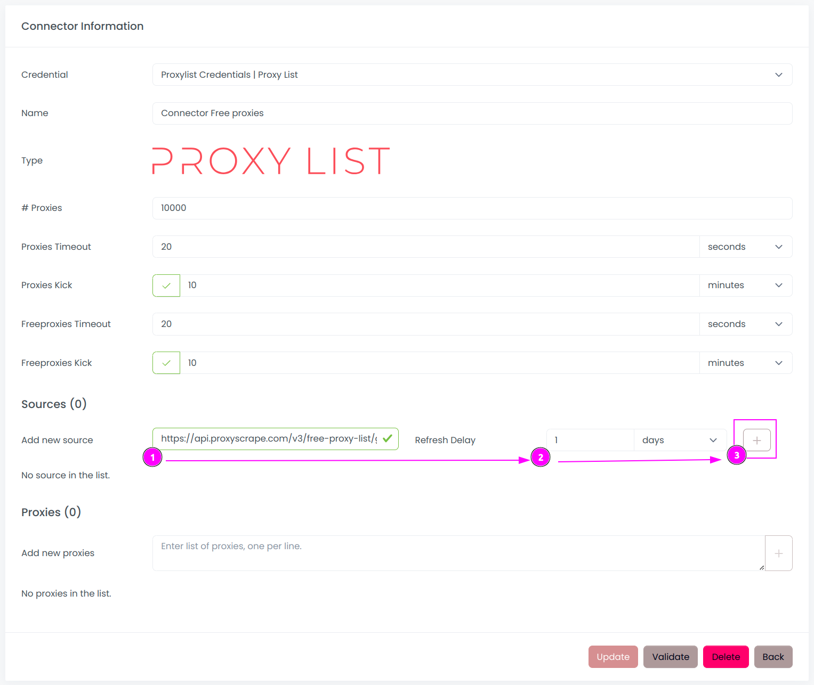
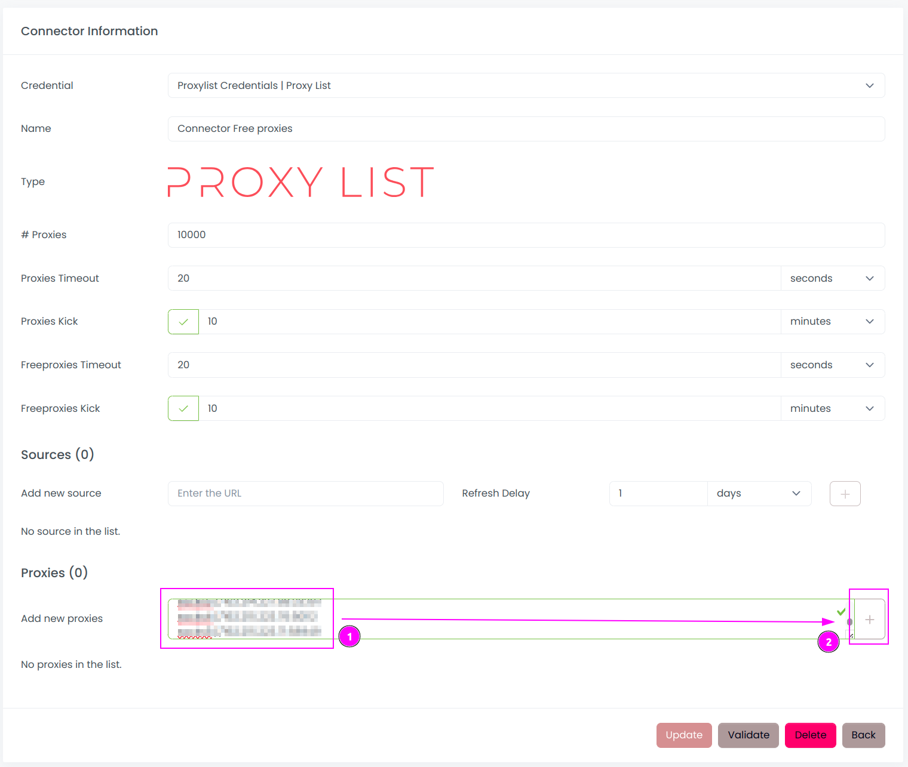

# Proxy List Connector

A _Proxy List_ is a specific type of connector designed to manage a manual list of proxies. 
Users have the flexibility to either utilize their own private proxies or incorporate a list of public proxies available on the Internet.

Scrapoxy supports HTTP/HTTPS proxies and SOCKS4/SOCKS5 proxies.

For instance, public proxies can be obtained from:
- [ProxyScrape](https://proxyscrape.com/free-proxy-list)
- [Spys One](https://spys.one)
- [IPRoyal](https://iproyal.com/free-proxy-list?r=432273)
- [Free Proxy CZ](http://free-proxy.cz)
- [Free Proxy World](https://www.freeproxy.world)
- [Proxy List Download](https://www.proxy-list.download)
- [Scraping Ant](https://scrapingant.com/free-proxies)
- [ProxyDB.net](https://proxydb.net)
- ...

::: info
Feel free to reach out to me on [Discord](https://discord.gg/ktNGGwZnUD) if you'd like to contribute and add your proxy list.
:::

## Scrapoxy

Open Scrapoxy User Interface and select `Marketplace`:

### Step 1: Create a new credential

Select `Proxy List` to create a new credential (use search if necessary).

---

Complete the form with the following information:
1. **Name**: The name of the credential

And click on `Create`.

::: info
This credential is a holder for the proxy list connector
because Scrapoxy always needs a credential to create a connector.
:::

### Step 2: Create a new connector

Create a new connector and select `Proxy List` as provider:

Complete the form with the following information:
1. **Credential**: The previous credential;
2. **Name**: The name of the connector;
3. **# Proxies**: The number of instances to create.
4. **Proxies Timeout**: Maximum duration for connecting to a proxy before considering it as offline;
5. **Proxies Kick**: If enabled, maximum duration for a proxy to be offline before being removed from the pool;
6. **Freeproxies Timeout**: Same as `Proxies Timeout` but for the freeproxies pool;
7. **Freeproxies Kick**: Same as `Proxies Kick` but for the freeproxies pool.

:::info
Adjust `Freeproxies Timeout` to a higher value to avoid removing proxies from the freeproxies pool too quickly.
:::

### Step 3: Add a proxies source

On the connector, click on `Update`.

---

1. Fill the URL of the proxy list;
2. Choose the refresh rate;
3. Click on `Add`.

Here is a good URL example from [ProxyScrape](https://api.proxyscrape.com/v3/free-proxy-list/get?request=displayproxies&proxy_format=protocolipport&format=text).
The URL must return a list of proxies, one per line. 
Scrapoxy will automatically fetch the list of proxies from the URL and update the connector.

::: info
It is recommended to activate `Freeproxies Kick` to curate offline proxies from the freeproxies pool.
Proxies will be added again when Scrapoxy fetches the list from the URL.
:::

### Step 4: Add manually some proxies

Copy / Paste a list of proxies in the textarea.

Scrapoxy supports theses formats:
- `ip:port`
- `ip:port:username:password`
- `http://ip:port`
- `http://username:password@ip:port`
- `https://ip:port`
- `https://username:password@ip:port`
- `socks://ip:port` (shortcut for `socks5://ip:port`)
- `socks://username:password@ip:port` (shortcut for `socks5://username:password@ip:port`)
- `socks4://ip:port`
- `socks4://username:password@ip:port`
- `socks5://ip:port`
- `socks5://username:password@ip:port`

--- 

Scrapoxy will assess the availability of proxies and retain only those
that are currently accessible for the connector.

The provided buttons offer the following functionalities:
- **Delete One Proxy**: Remove a specific proxy from the list;
- **Delete Offline Proxies**: Eliminate proxies that are either offline or in a waiting state for fingerprinting;
- **Delete Duplicates**: Remove proxies that share the same outbound IP address;
- **Delete All Proxies**: Clear the entire proxy list.

### Step 4: Start the connector

1. Start the project;
2. Start the connector.

---

You can use the proxies on the connector.

### Other: Stop the connector

1. Stop the connector;
2. Wait for proxies to be removed.
