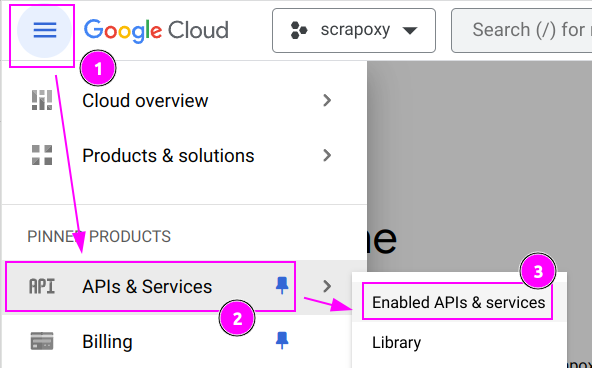
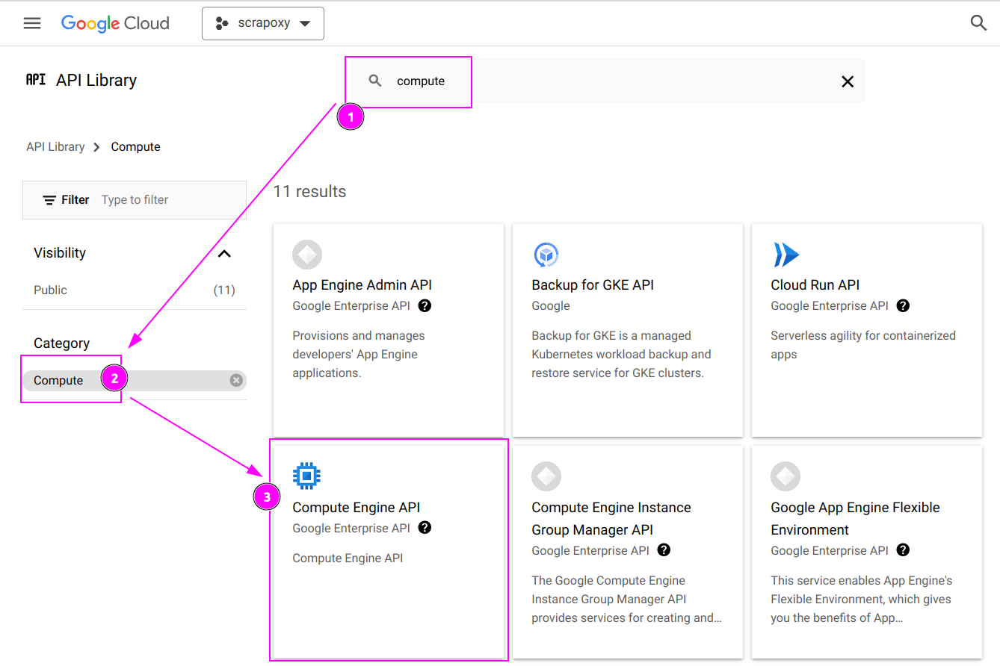
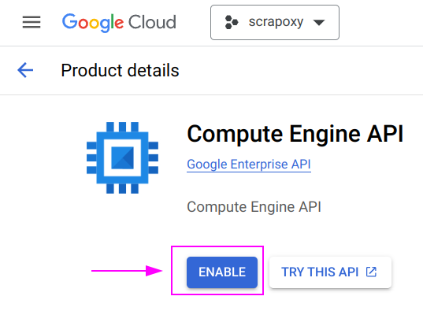
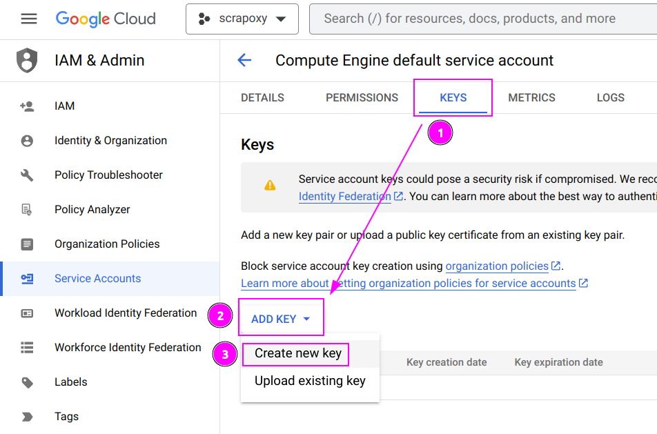
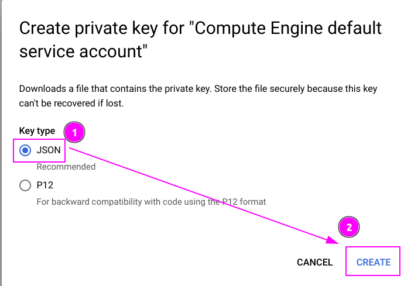
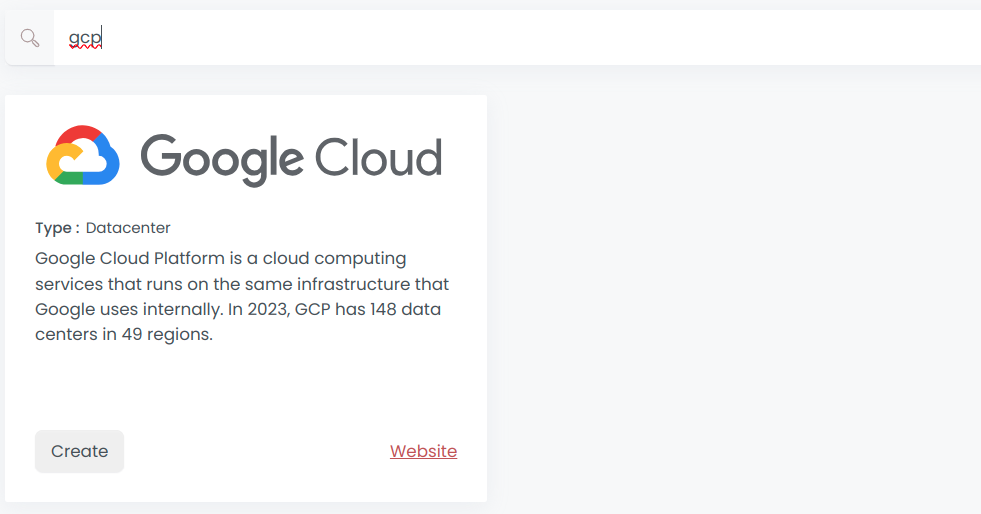
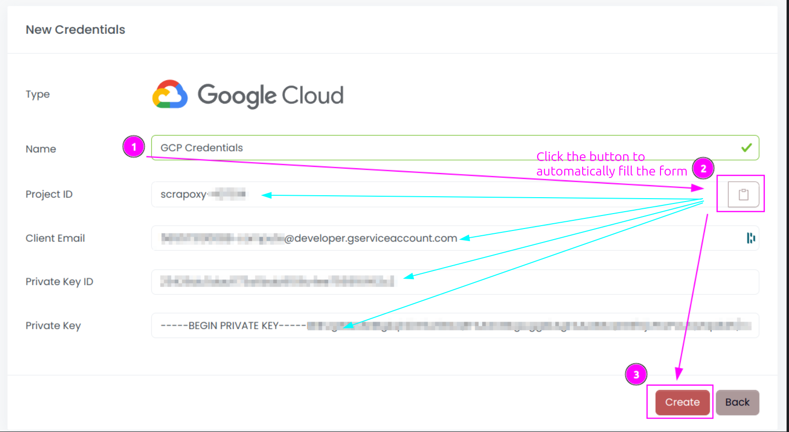
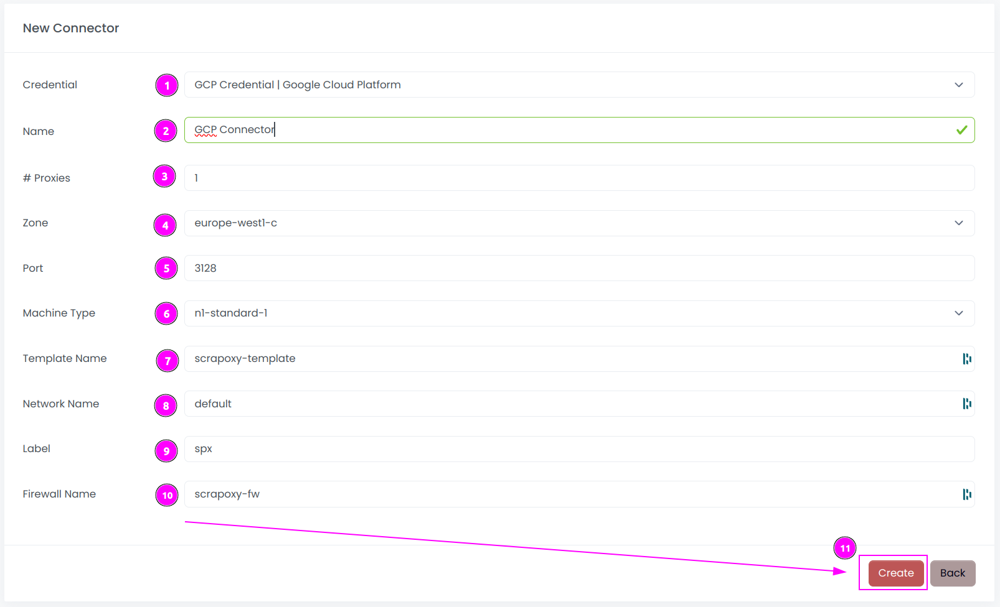

# Google Cloud Platform Connector

{width=280 nozoom}

[Google Cloud Platform](https://cloud.google.com) is a cloud computing services that runs on the same infrastructure
that Google uses internally.

## Prerequisites

An active GCP subscription is required.

## GCP Console

Connect to [Console](https://console.cloud.google.com).

### Step 1: Create new project

1. On the top left, click on the current project,
2. And click on `NEW PROJECT`.

---

1. Enter `scrapoxy` as Project name;
2. And click on `CREATE`.

---

Wait for the project to be created. A notification appears when it's done:

Click on `SELECT PROJECT`.

### Step 2: Create new credential

1. On the top left, click on the hamburger menu;
2. Click on `APIs & Services`;
3. And click on `Enabled APIs & services`.

---

1. On tab `Enabled APIs & services`,
2. Click on `+ ENABLE APIS AND SERVICES`.

---

1. Search `compute`;
2. In the category `Compute`,
3. Click on `Compute Engine API`.

---

Click on `ENABLE`.

---

1. Select `KEYS` tab;
2. Click on `ADD KEY`;
3. And click on `Create new key`.

---

1. Select `JSON` as key type;
2. And click on `CREATE`.

---

Open the downloaded file and copy the content in the clipboard.

## Scrapoxy

Open Scrapoxy User Interface and select `Marketplace`:

### Step 1: Create a new credential

Select `GCP` as provider to create a new credential (use search if necessary).

---

1. Complete the **Name** of the credential;
2. Click on the `Clipboard` icon to paste the JSON content. It will complete the form;
3. Click on `Create`.

### Step 2: Create a new connector

Create a new connector and select `GCP` as provider:

Complete the form with the following information:
1. **Credential**: The previous credential;
2. **Name**: The name of the connector;
3. **# Proxies**: The number of instances to create;
4. **Zone**: The region where the instances will be created;
5. **Port**: The port of the proxy (on GCP);
6. **Machine Type**: The type of the instance;
7. **Template Name**: The name of the template to use; 
8. **Network Name**: The name of the network to use; 
9. **Label**: The default label to tag instance;
10. **Firewall Name**: The name of the firewall rule.

And click on `Create`.

::: tip
You can retain most of the default values if they are suitable for your use case.
:::

### Step 3: Install the connector

On the connector list, click on `Install`.

---

Complete the form with the following information:
1. **Disk Type**: The type of the disk;
2. **Disk Size**: The size of the disk (in GB).

And click on `Install`.

::: tip
You can retain most of the default values if they are suitable for your use case.
:::

Scrapoxy will start, install and stop the VM to create a custom image.

---

When the installation is finished, click on `Connectors`.

---

1. Start the project;
2. Start the connector.

### Other: Uninstall the connector

1. Stop the connector;
2. Wait for proxies to be removed.

---

On the connector list, click on `Uninstall`.

---

Confirm the uninstallation.

Wait for the uninstallation to finish: Scrapoxy will delete the custom image.
