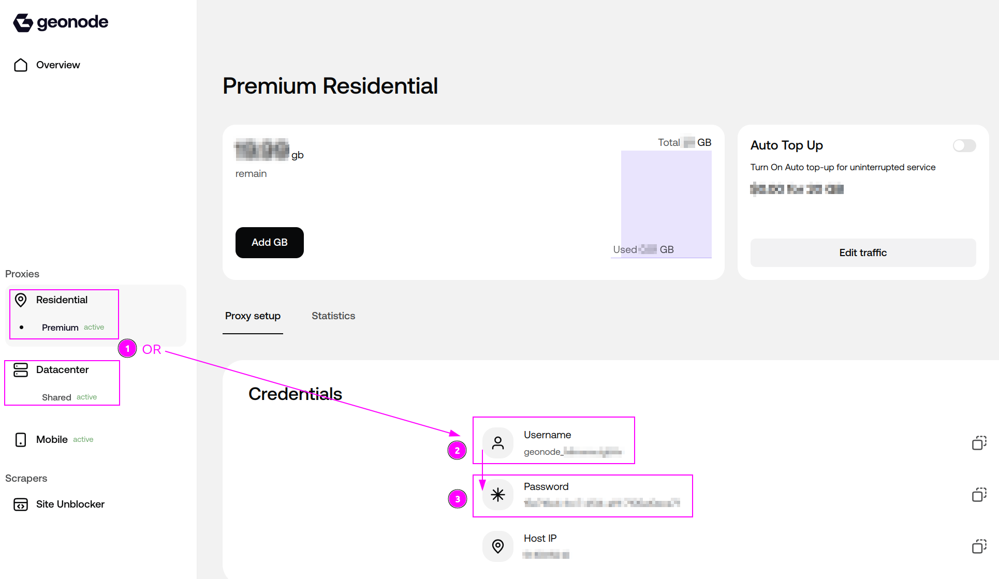
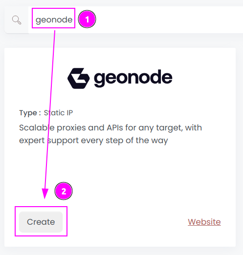
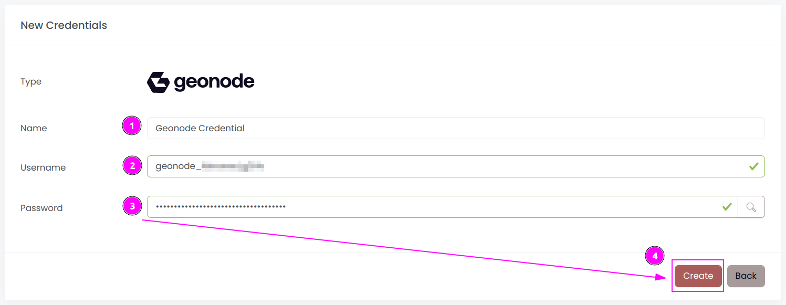
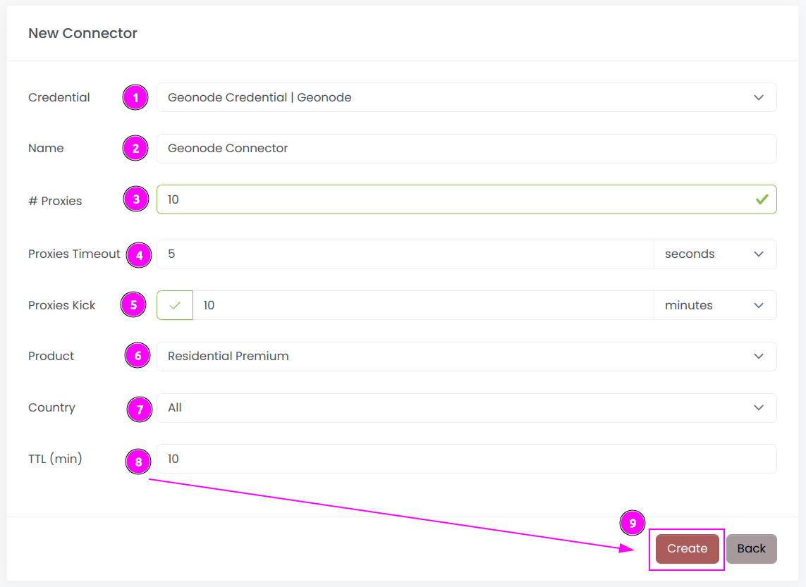

# Geonode Connector

{width=280 nozoom}

[Geonode](/l/geonode) provides the Right Proxies for Your Business. 
Join thousands of developers using the fastest-growing residential proxy network. 
Geonode’s proxies speak for themselves.

Scrapoxy is compatible with **Residential Premium** and **Datacenter Shared** products.

## Prerequisites

An active Geonode subscription is required.

## Geonode Dashboard

Connect to [Dashboard](/l/geonode-dashboard).

### Get credentials

1. Select one of your product between Residential Premium or Datacenter Shared
2. Remember the `username`.
3. Remember the `password`.

## Scrapoxy

Open Scrapoxy User Interface and select `Marketplace`:

### Step 1: Create a new credential

Select `Geonode` to create a new credential (use search if necessary).

---

Complete the form with the following information:
1. **Name**: The name of the credential;
2. **Username**: The username;
3**Password**: The password.

And click on `Create`.

### Step 2: Create a new connector

Create a new connector and select `Geonode` as provider:

Complete the form with the following information:
1. **Credential**: The previous credential;
2. **Name**: The name of the connector;
3. **# Proxies**: The number of instances to create;
4. **Proxies Timeout**: Maximum duration for connecting to a proxy before considering it as offline;
5. **Proxies Kick**: If enabled, maximum duration for a proxy to be offline before being removed from the pool;
6. **Product**: Select the product to use;
7. **Country**: Select the country to use, or `All` to use all countries;
8. **TTL**: Select the duration of the sticky session;

And click on `Create`.

### Step 3: Start the connector

1. Start the project;
2. Start the connector.

### Other: Stop the connector

1. Stop the connector;
2. Wait for proxies to be removed.
