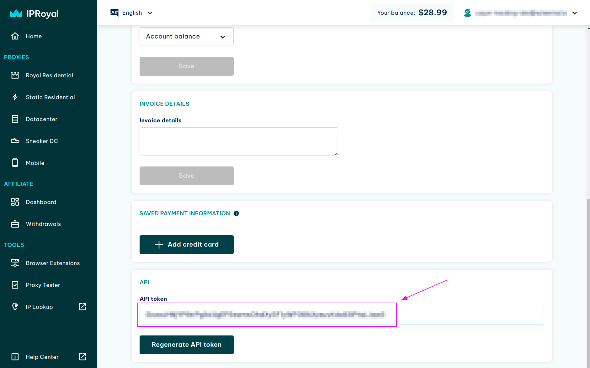
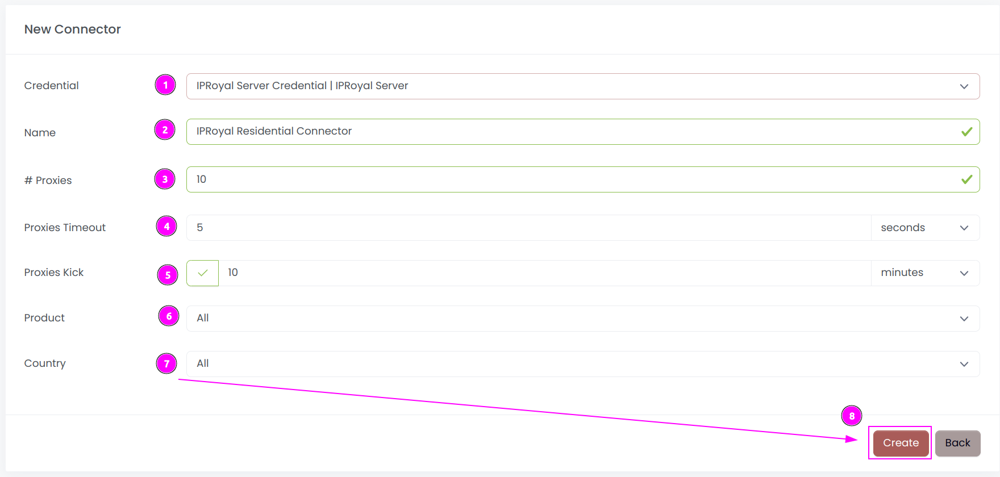

# IPRoyal Static IP Connector

{width=230 nozoom}

[IPRoyal](https://iproyal.com/?r=432273) is a proxy provider that offers a versatile selection of different proxies. These include top-end residential proxies, datacenter proxies, and even niche-specific sneaker proxies

This connector is for Static Residential Proxies, Sneaker DC Proxies, and Datacenter Proxies.

::: info
For 4G proxies, it is advisable to utilize the [Free Proxies List](../../freeproxies/guide),
as IPRoyal does not offer an API for this category.
:::

Server Proxies are static endpoints featuring a dedicated IP address. 

## Prerequisites

An active IPRoyal subscription is required on Static Residential Proxies, Sneaker DC Proxies, or Datacenter Proxies.

## IPRoyal Dashboard

Connect to [Dashboard](https://dashboard.iproyal.com?r=432273).

### Get the account credentials

1. On the top right menu, click on your username;
2. Click on `Settings`.

---

Remember `API Token`.

## Scrapoxy

Open Scrapoxy User Interface and select `Marketplace`:

### Step 1: Create a new credential

Select `IPRoyal` with type `Static IP` as provider to create a new credential (use search if necessary).

---

Complete the form with the following information:
1. **Name**: The name of the credential;
2. **Token**: The token of the API.

And click on `Create`.

### Step 2: Create a new connector

Create a new connector and select `IPRoyal` as provider:

Complete the form with the following information:
1. **Credential**: The previous credential;
2. **Name**: The name of the connector;
3. **# Proxies**: The number of instances to create;
4. **Product**: Select the product to use, or `All` to use all products;
5. **Country**: Select the country to use, or `All` to use all countries.

And click on `Create`.

### Step 3: Start the connector

1. Start the project;
2. Start the connector.

### Other: Stop the connector

1. Stop the connector;
2. Wait for proxies to be removed.
