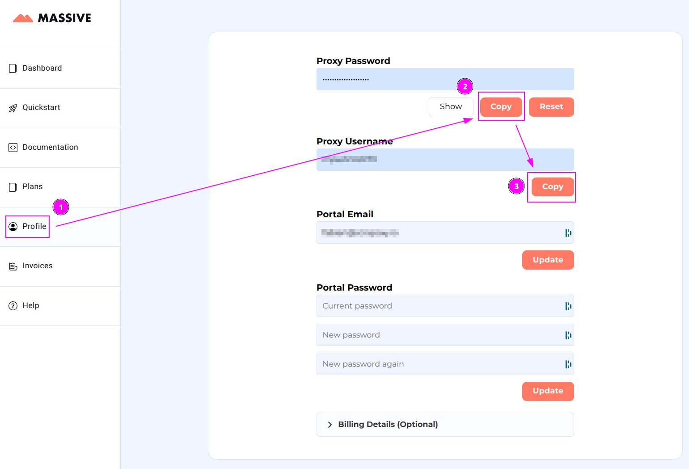
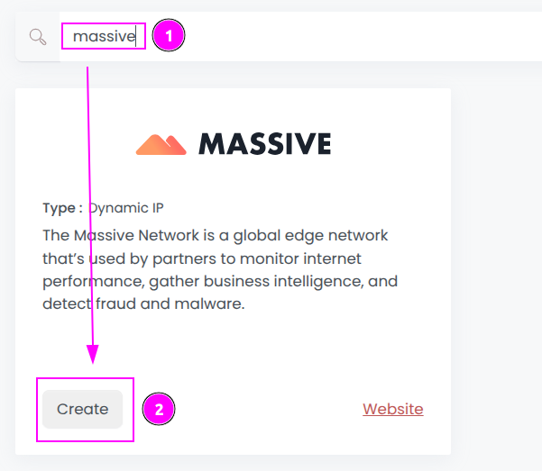
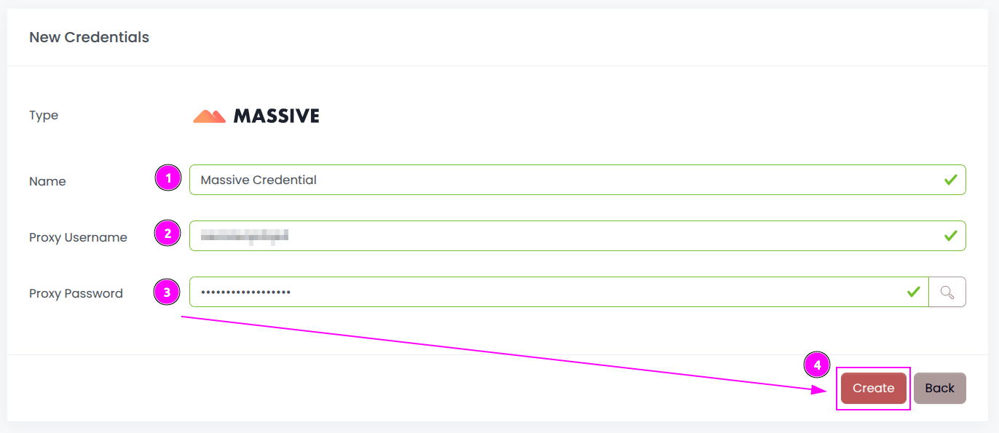
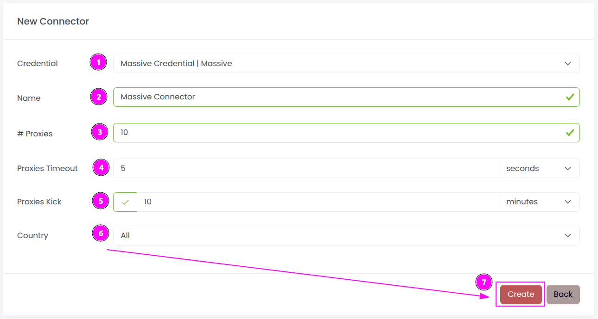

# Massive Connector

{width=230 nozoom}

[Massive Network](https://partners.joinmassive.com/plans?ref=oguwmwr) offers a robust residential proxy network featuring full global coverage, 
device type targeting, and precise city, state, and ZIP-level targeting. 
With an extensive IP pool, top-tier performance, competitive pricing, and 100% ethically sourced residential IPs, 
Massive delivers unmatched reliability and flexibility for businesses worldwide.

::: info
Residential Proxies are accessed via a unique endpoint, and the link is maintained through a sticky session mechanism.
:::

## Prerequisites

An active Massive subscription is required.

## Massive Dashboard

Connect to [Dashboard](https://partners.joinmassive.com/dashboard?ref=oguwmwr).

## Get the proxy credentials

1. On the left menu, select `Profile`;
2. On `Proxy Username`, click on `Copy` and remember the value.
3. On `Proxy Password`, click on `Copy` and remember the value;

## Scrapoxy

Open Scrapoxy User Interface and select `Marketplace`:

### Step 1: Create a new credential

Select `Massive` with type `Dynamic IP` to create a new credential (use search if necessary).

---

Complete the form with the following information:

1. **Name**: The name of the credential;
2. **Proxy Username**: The username of the Proxy;
3. **Proxy Password**: The password of the Proxy.

And click on `Create`.

### Step 2: Create a new connector

Create a new connector and select `Massive` as provider:

Complete the form with the following information:
1. **Credential**: The previous credential;
2. **Name**: The name of the connector;
3. **# Proxies**: The number of instances to create;
4. **Proxies Timeout**: Maximum duration for connecting to a proxy before considering it as offline;
5. **Proxies Kick**: If enabled, maximum duration for a proxy to be offline before being removed from the pool;
6. **Country**: Select the country to use, or `All` to use all countries.

And click on `Create`.

### Step 3: Start the connector

1. Start the project;
2. Start the connector.

### Other: Stop the connector

1. Stop the connector;
2. Wait for proxies to be removed.
