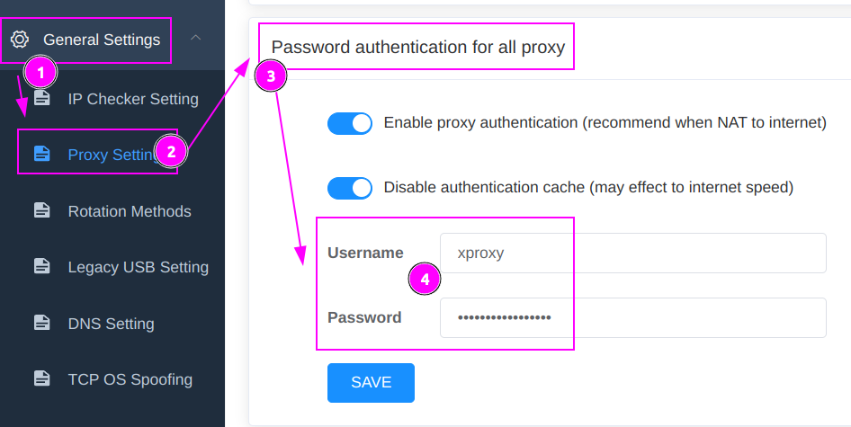
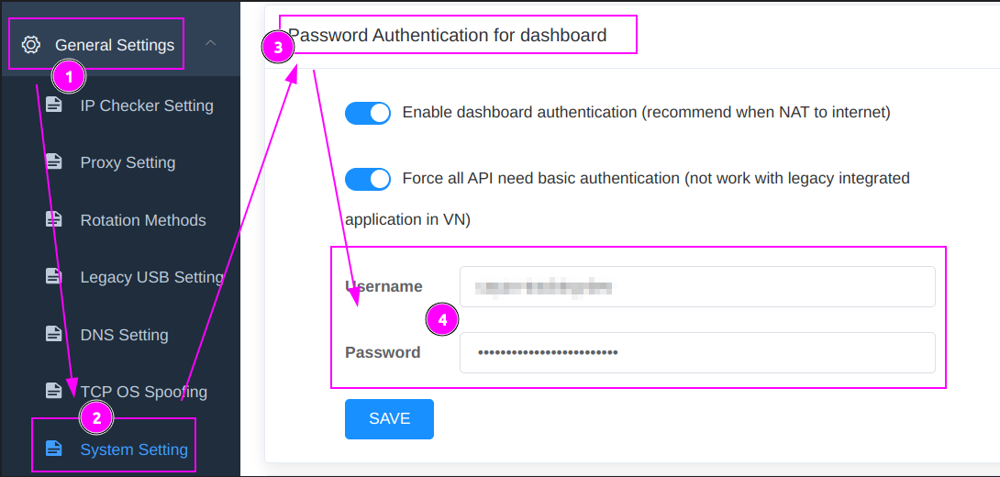
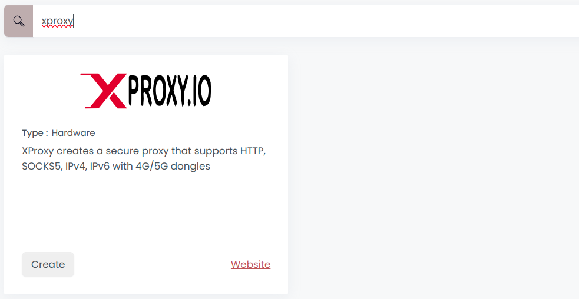
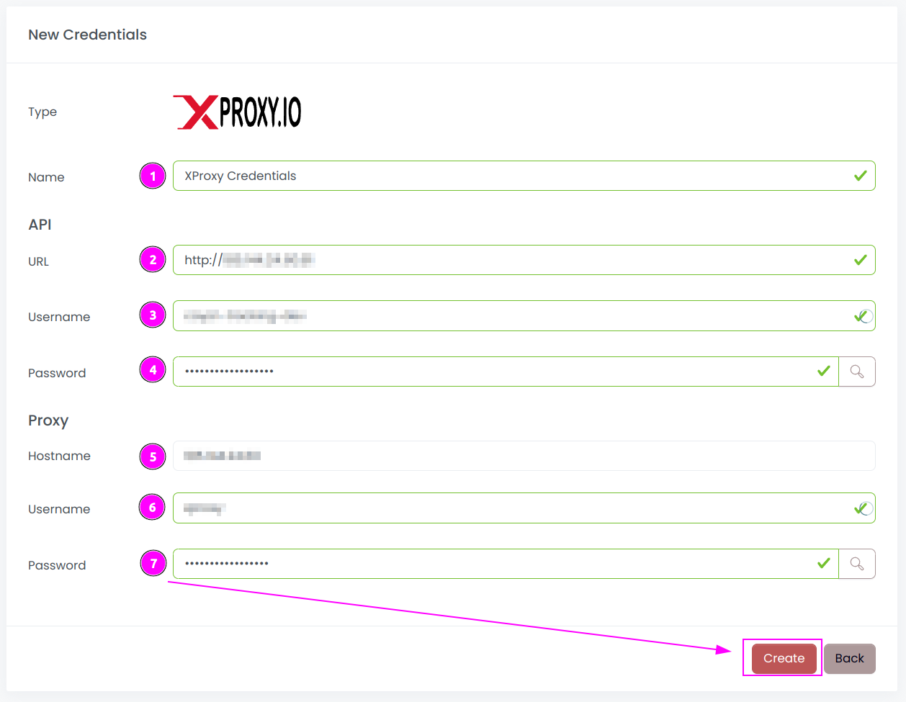
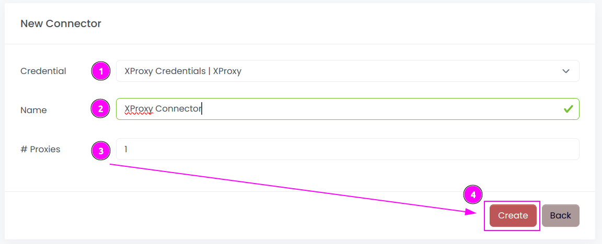

# XProxy Connector

{width=230 nozoom}

[XProxy](https://xproxy.io) creates a secure proxy that supports HTTP, SOCKS5, IPv4, IPv6 with 4G/5G dongles.

## Prerequisites

Before using XProxy, ensure the following prerequisites are met:

1. Obtain XProxy materials and subscribe to the service.
2. Ensure that Scrapoxy has access to the XProxy admin interface and proxy IP addresses.

::: warning
Be aware that XProxy employees have SSH root access to the material, and the password cannot be changed.
:::

It is recommended to deploy the XProxy box behind a firewall in a [DMZ (Demilitarized Zone)](https://en.wikipedia.org/wiki/DMZ_(computing)).
This configuration enables control over inbound connections to the box while preventing any outbound connections to your internal network.

## XProxy Admin

Connect to your XProxy hardware UI and remember the URL.

### Get the credentials

1. Click on `General Settings`;
2. Select `Proxy Settings`;
3. Navigate to `Password authentication for all proxy`;
4. Remember `Username` and `Password` for the proxy.

::: warning
The password can only be changed and not viewed.
:::

---

1. Click on `General Settings`;
2. Select `System Settings`;
3. Navigate to `Password Authentication for dashboardy`;
4. Remember `Username` and `Password` for the API.

::: warning
The password can only be changed and not viewed.
:::

## Scrapoxy

Open Scrapoxy User Interface and select `Marketplace`:

### Step 1: Create a new credential

Select `XProxy` as provider to create a new credential (use search if necessary).

---

Complete the form with the following information:
1. **Name**: The name of the credential;
2. **API URL**: URL of the XProxy Admin (without trailing `/`);
3. **API Username**: The username for the API;
4. **API Password**: The password for the API;
5. **Proxy Username**: The username of the proxy;
6. **Proxy Password**: The password of the proxy;

And click on `Create`.

### Step 2: Create a new connector

Create a new connector and select `XProxy` as provider:

Complete the form with the following information:
1. **Credential**: The previous credential;
2. **Name**: The name of the connector;
3. **# Proxies**: The number of instances to create.

And click on `Create`.

### Step 3: Start the connector

1. Start the project;
2. Start the connector.

### Step 4: Interact with modems

Within this connector, you can perform 2 actions on the proxies:
1. **Trash button**: Initiates a fast rotation of the modem;
2. **Cross button**: Triggers a slower process, rebooting the modem.

### Other: Stop the connector

1. Stop the connector;
2. Wait for proxies to be removed.
