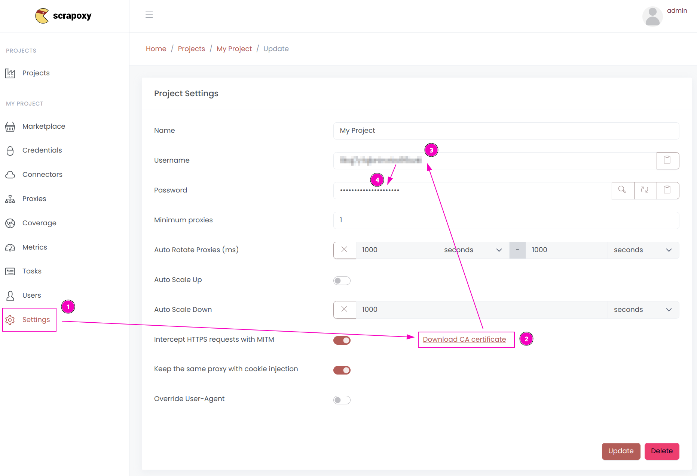

# Axios

{width=230 nozoom}

[Axios](/l/axios) is a library to make HTTP requests. It handles CA certificate and proxy.

::: info
The `https-proxy-agent` library lacks support for these features.
Consequently, using node `https` or` node-fetch` libraries is not feasible.
:::


## Step 1: Install the library

```shell
npm install axios
```


## Step 2: Retrieve CA certificate and project credentials



1. Open Scrapoxy User interface, and go to the project `Settings`;
2. Click on `Download CA certificate` and save the file;
3. Remember the project's `Username`;
4. Remember the project's `Password`.

::: info
It is assumed that file is saved in `/tmp/scrapoxy-ca.crt`.
:::


## Step 3: Create and run the script

Create a file name `make_requests.js` with the following content:

```javascript
import axios from 'axios';
import fs from 'fs';
import { Agent } from 'https';

(async () => {
    const ca = fs.readFileSync('/tmp/scrapoxy-ca.crt');

    const res = await axios.get(
        'https://fingerprint.scrapoxy.io',
        {
            proxy: {
                host: 'localhost',
                port: 8888,
                protocol: 'http',
                auth: {
                    username: 'USERNAME',
                    password: 'PASSWORD'
                },
            },
            httpsAgent: new Agent({
                ca,
            }),
        },
    );
    
    console.log('proxy instance:', res.headers['x-scrapoxy-proxyname']);
    console.log(res.data);
})()
    .catch(console.error);
```

Replace `USERNAME` and `PASSWORD` by the credentials you copied earlier.

Scrapoxy includes a `x-scrapoxy-proxyname` header in each response, 
indicating the name of the proxy instance assigned for the request.

Run the script:

```shell
node make_requests.js
```


## Step 4: Sticky session (optional)

To reuse the same proxy instance for all requests, add the following line:

```javascript
import axios from 'axios';
import fs from 'fs';
import { Agent } from 'https';

(async () => {
    const ca = fs.readFileSync('/tmp/scrapoxy-ca.crt');

    const res = await axios.get(
        'https://fingerprint.scrapoxy.io',
        {
            headers: {
                'X-Scrapoxy-Proxyname': 'PROXYNAME',
            },
            proxy: {
                host: 'localhost',
                port: 8888,
                protocol: 'http',
                auth: {
                    username: 'USERNAME',
                    password: 'PASSWORD'
                },
            },
            httpsAgent: new Agent({
                ca,
            }),
        },
    );
    
    console.log('proxy instance:', res.headers['x-scrapoxy-proxyname']);
    console.log(res.data);
})()
    .catch(console.error);
```

Replace `PROXYNAME` by the proxy instance name you want to use.
