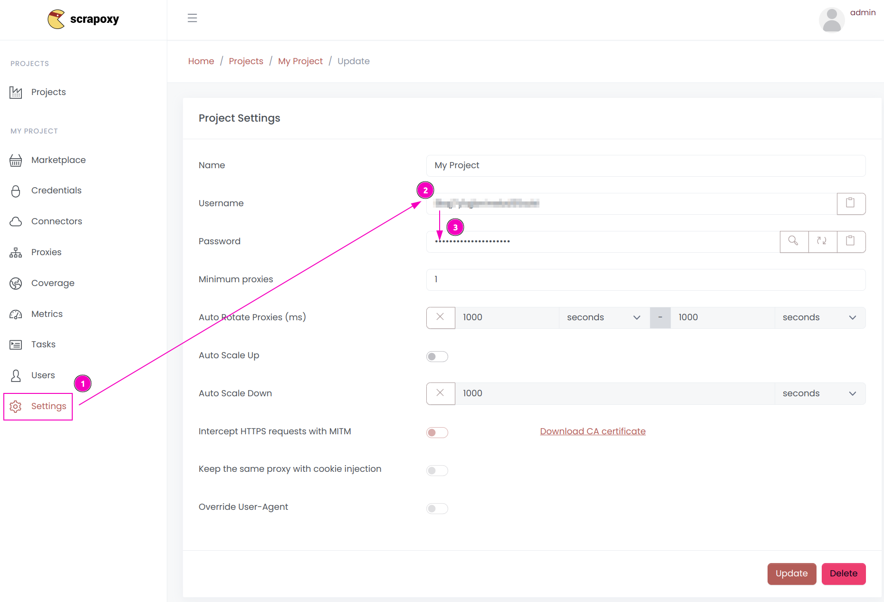

# Kameleo Integration

{width=230 nozoom}

This tutorial uses [Kameleo](/l/kameleo), 
an anti-detect browser designed for web-scraping.

Kameleo provides a powerful antidetect browser for better data collection on websites with anti-bot detection systems such as Cloudflare, DataDome, and PerimeterX.
It combines headless browsers, proxies, and top-tier automation framework support for smooth web scraping. 
Change fingerprint parameters to ensure your activities blend seamlessly into regular web traffic, **minimizing bot detection risks**.

::: warning
Kameleo **cannot use the MITM mode of Scrapoxy**,
as it would disrupt the TLS fingerprint and compromise anti-detection functionality.
:::

However, Kameleo supports **session management via HTTP/2**, 
allowing a single browser session to work with a dedicated IP, 
as recommended in its documentation.


## Step 1: Install the Python framework

```shell
pip install kameleo.local-api-client
```


### Step 2: Retrieve Scrapoxy credentials



1. Open Scrapoxy User interface, and go to the project `Settings`;
2. Remember the project's `Username`;
3. Remember the project's `Password`.


## Step 3: Download and install Kameleo.CLI

Kameleo can be found
[here](/l/kameleo-downloads).


## Step 4: Start Kameleo.CLI

### On Windows

Open the command prompt and run the following command:

```shell
C:\Users\<YOUR_USERNAME>\AppData\Local\Programs\Kameleo\Kameleo.CLI.exe email=YOUR_EMAIL password=YOUR_PASSWORD
```

Replace `YOUR_EMAIL` and `YOUR_PASSWORD` with Kameleo credentials.


**MacOS:**

Open the command prompt and run the following command:

```shell
/Applications/Kameleo.app/Contents/Resources/CLI/./Kameleo.CLI email=YOUR_EMAIL password=YOUR_PASSWORD
```

Replace `YOUR_EMAIL` and `YOUR_PASSWORD` with Kameleo credentials.


## Step 5: Connect to Kameleo.CLI in Python

Kameleo consists of multiple components running both locally and in the cloud.

The core logic resides in the Kameleo CLI component on the local device, which handles all application actions.
For instance, it launches preconfigured browsers and saves their current states into virtual browser profile files.

When this component is started, a REST API becomes available on the local interface (by default at http://localhost:5050).

The available endpoints and models can be reviewed on SwaggerHub or by visiting http://localhost:5050/swagger.

Connect to the Kameleo CLI:

```python
from kameleo.local_api_client import KameleoLocalApiClient

kameleo_port = 5050

client = KameleoLocalApiClient(
  endpoint=f'http://localhost:{kameleo_port}',
  retry_total=0
)
```


## Step 6: Search fresh & real fingerprints

Base profiles are **real-world browser fingerprint** configurations used to create virtual browser profiles.
This ensures that the browser profile maintains a consistent footprint after the spoofing mechanism is applied,
as most data is derived from an actual browser.

The remaining data is generated automatically during profile creation.

Filters can be applied to hundreds of thousands of base profiles to select those with the desired language,
operating system, and browser.

Get all the profiles:

```python
base_profiles = client.search_base_profiles(
  device_type='desktop',
  browser_product='chrome',
  os_family='windows',
  language='en-us'
)
```


## Step 7: Configure browser fingerprint & Set Up Scrapoxy

Set up a profile compatible with Scrapoxy:

```python
from kameleo.local_api_client.builder_for_create_profile import BuilderForCreateProfile
from kameleo.local_api_client.models import Server

create_profile_request = BuilderForCreateProfile \
  .for_base_profile(base_profiles[0].id) \
  .set_name('kameleo scrapoxy integration') \
  .set_recommended_defaults() \
  .set_proxy('http', Server(host='localhost', port=8888, id='USERNAME', secret='PASSWORD')) \
  .set_start_page("https://kameleo.io") \
  .build()

profile = client.create_profile(body=create_profile_request)
```

The recommended default settings are designed to work with most anti-bot systems.

It is possible to experiment with different browsers, as well as settings for [canvas](/l/kameleo-canvas),
WebGL, audio spoofing, and more.


## Step 8: Start browser profile

Kameleo includes 2 custom-built browsers designed to bypass anti-bot systems during web scraping:

* Chrome, Edge, and Safari are emulated by [Chroma](/l/kameleo-chroma).;
* Firefox is emulated by [Junglefox](/l/kameleo-junglefox).

Start the browser profile:

```python
client.start_profile(profile.id)
```


## Step 9: Automate the browser

Kameleo supports the most popular automation frameworks, such as
[Selenium](/l/selenium),
[Puppeteer](/l/puppeteer), and
[Playwright](/l/playwright).

Thanks to Kameleo **anti-bot systems won't recognise the presence** of an automation framework.


### Selenium

Install the Selenium package:

```shell
pip install selenium
```

And open Kameleo's browser on Cloudflare:

```python
from selenium import webdriver

options = webdriver.ChromeOptions()
options.add_experimental_option("kameleo:profileId", profile.id)
driver = webdriver.Remote(
  command_executor=f'http://localhost:{kameleo_port}/webdriver',
  options=options
)

driver.get('https://cloudflare.com')
```


### Puppeteer

Install the Puppeteer and Asyncio packages:

```shell
pip install pyppeteer asyncio
```

And open Kameleo's browser on Cloudflare:

```python
import pyppeteer
import asyncio

async def main():
    browser_ws_endpoint = f'ws://localhost:{kameleo_port}/puppeteer/{profile.id}'
    browser = await pyppeteer.launcher.connect(
      browserWSEndpoint=browser_ws_endpoint,
      defaultViewport=False)
    page = await browser.newPage()
    
    await page.goto('https://cloudflare.com')

asyncio.run(main())
```


### Playwright

Install the Playwright package:

```shell
pip install playwright
```

And open Kameleo's browser on Cloudflare:

```python
from playwright.sync_api import sync_playwright

browser_ws_endpoint = f'ws://localhost:{kameleo_port}/playwright/{profile.id}'
with sync_playwright() as playwright:
  browser = playwright.chromium.connect_over_cdp(endpoint_url=browser_ws_endpoint)
  context = browser.contexts[0]
  page = context.new_page()
  page.goto('https://cloudflare.com')
```


## More Documentation

For more information about Kameleo, check out the following resources:

* [Terminology](/l/kameleo-terminology)
* [Getting Started guide](/l/kameleo-getting-started)
* [Examples on Kameleo's GitHub](/l/kameleo-examples)
