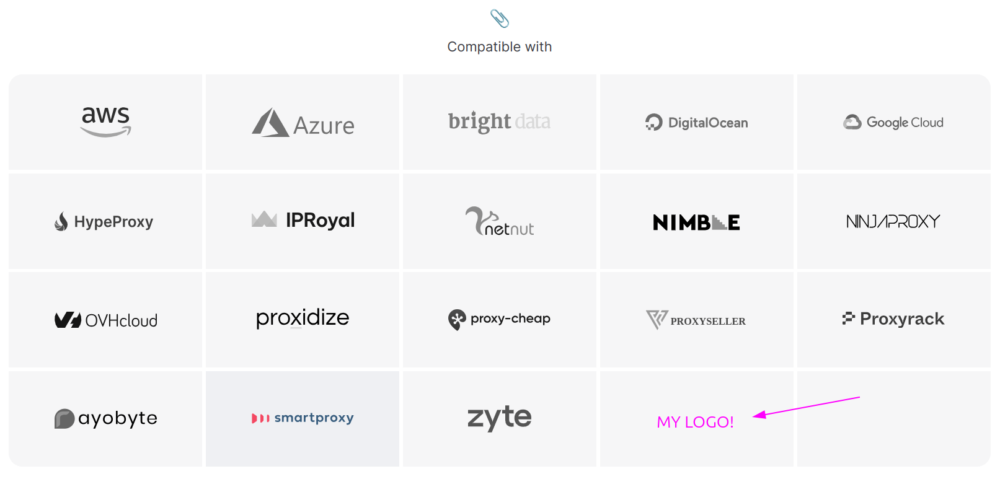

# Partners Integration

Many companies often ask, "Hey! How can we get on the logo list?" 
or "Can we do an affiliate link exchange?" 🔗

To help answer these questions, I've put together this integration guideline.

**Please take a moment to read it before reaching out.**

If you still have any questions, I'd be happy to help. 😊

## Partnerships

Before considering a partnership, it's important to understand how Scrapoxy works.

Scrapoxy isn't a typical proxy provider; it's a **super proxies manager** installed on the user infrastructure.
It creates a pool of private proxies from their **datacenter** subscription 🔒,
integrates them with proxy vendors 🔌, handles IP rotation and fingerprinting,
and smartly routes traffic to **avoid bans** 🚫.

Partnering with Scrapoxy involves a **technical integration** 🔧 that requires me to write a custom connector. 
It's a bit more involved than just a link exchange. 😅

::: info
If you're just looking for a **simple link exchange**, 
I hope to offer that in the future, but it's not available right now.
:::

## Proxy Providers

### Why should I integrate Scrapoxy?

Scrapoxy bridges the gap between proxies and scrapers.

As your data collection infrastructure grows, you’ll need more than a custom **homemade script** to manage proxy rotation.
Advanced features like geotargeting 🌎, circuit-breaker patterns ⚡, and smart proxy rotation 🔌 become essential.
Additionally, combining multiple proxy providers—such as ISP, Residential, or Mobile proxies—with your datacenter proxies from AWS or GCP requires sophisticated management.
Scrapoxy handles all of this seamlessly.

Scrapoxy is designed for **companies**, not individuals, and it has been attracting more and more businesses because it is **free and open-source**.
This mature project, established in 2016, is used by **over 400 companies worldwide**, managing hundreds of terabytes of data exchanged daily.

Scrapoxy supports major **cloud providers** and key **proxy services**, ensuring robust and flexible proxy management.

### Why should Scrapoxy integrate me?

First, there are [technical requirements](#technical-requirements) that must be met before starting the integration.

Second, there are business-oriented considerations.

While Scrapoxy is free and open-source for users, it is **not free for providers** (with some exceptions [see below](#exceptions)).

Even though I'm passionate about this project and work on it full-time 💯,
it typically takes me around **2 weeks** to fully integrate a partner.
Therefore, I charge the following fees 💲:

| Company size | # of customers | First Year Fee | Next Year Fee |
|--------------|----------------|---------------|-------------|
| Small        | 1-10000        | $3400         | $2200       | 
| Large        | 10000+         | $17000        | $12000      |   

The fee structure is based on the number of customers you have.

The fees are broken down as follows:

- **Development fee**: A *one-time* fee covering extensive development work, including meeting time, user engagement, and marketing efforts.
- **Maintenance fee**: A *monthly recurring* fee covering maintenance, issue resolution, server hosting, etc.

A **12-month commitment** is required.

#### Exceptions

However, exceptions for a **fee waiver** may be made if your product brings **something new** to Scrapoxy’s users,
such as unusual geographical regions or new types of proxies.

I can also reduce the fee if:

- You already meet all the [technical requirements](#technical-requirements), and the development time will be short.
- You will develop the connector yourself following [this guide](../contrib/connector.md) (review and maintenance will still be required)
- You significantly contribute to promoting Scrapoxy on your end.
- You have an affiliation program.

### Technical Requirements

Scrapoxy uses your users' credentials to connect to your proxy network.

#### Sticky sessions

Scrapoxy relies on **sticky sessions**, so your product must support this feature.
This can be achieved through fixed server IPs, session IDs in the connection credentials, etc.

#### Subscriptions

You must provide a subscription for each of your products.
Typically, this means 2 IPs for IP-based products and 2 GB for GB-based products.

These subscriptions must be valid for **at least 12 months** to ensure maintenance.

#### API

Scrapoxy needs to retrieve all connection information through your API, including:

- List of proxies
- Proxy IP and port
- Credentials (`username:password`)

Users should not need to enter this information manually;
they will use a token (or `login:password`) to connect to your API and gather the necessary details.

#### API Access

Users can easily access API credentials through your UI.

Refer to the documentation for [examples](../connectors/brightdata/guide#create-a-token).

#### API Rate Limit

Your API should handle at least **5 requests per second for each subscription**.

#### Whitelisting

Your **entire network** must whitelist HTTP GET calls to the domain `fingerprint.scrapoxy.io`.
This domain is used to check the connectivity of each proxy and avoid routing traffic to offline proxies.

::: info
There must be no rate limit on this domain.
:::

## Other Types of product

If you're not a proxy provider but would like to integrate your product with Scrapoxy (e.g., an anti-detect browser or a scraping framework), 
I'd be happy to add an integration guide in the documentation.

I kindly ask that you write the documentation and send it to me.

Please check the examples [here](../integration/python/scrapy/guide.md).

## Contact

If you agree with all the conditions,
you can join [Scrapoxy’s Discord](/l/discord-scrapoxy) and contact me in DM. 💬
