# Web Interface

## Login

User interface is accessible at: [http://localhost:8890](http://localhost:8890).

---

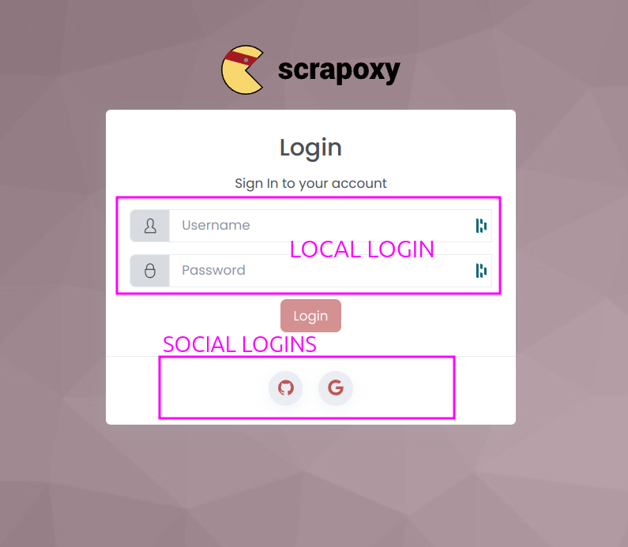

When you open Scrapoxy User interface, Scrapoxy prompts you to log in.

Scrapoxy offers various login methods depending on your configuration:
- **Local User/Password**: Allows only one user.
- **Social Logins**: Supports authentication through platforms like Google, Github, etc.

## Layout

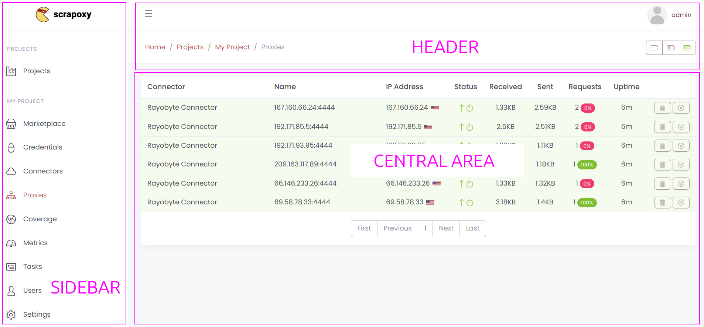

The administration interface includes the following components:

- **Left Menu**: Facilitates navigation between different project sections.
- **Header**: Displays the name of the connected user and provides a menu for accessing user settings and logging out.
- **Central Area**: Reserved for displaying pages and relevant content.

## Project

### Project Settings

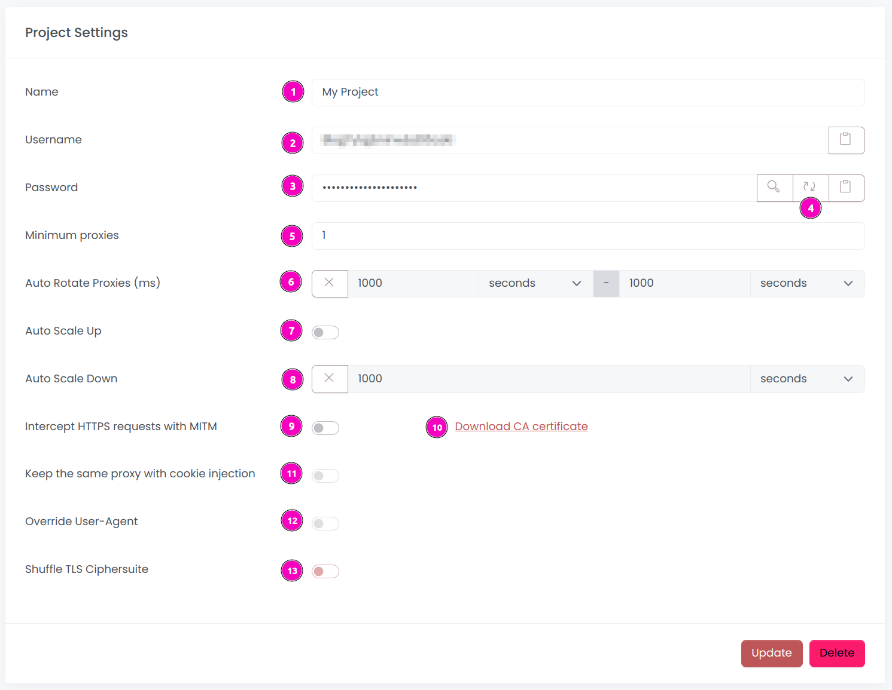

During the initial connection, Scrapoxy will guide you through the creation of a new project with the following settings:
1. **Name**: Unique identifier for the project;
2. **Username**: Authentication username used for proxy authentication in requests (click on the `clipboard` icon to copy the username);
3. **Password**: Authentication password used for proxy authentication in requests (click on the `clipboard` icon to copy the password);
4. **Renew token**: Click on this button to renew username and password;
5. **Minimum proxies**: The minimum number of proxies online when the project status is CALM;
6. **Auto Rotate Proxies**: If enabled, proxies are automatically rotated at random intervals within the specified **Delay range**; 
7. **Auto Scale Up**: When enabled, the project status switches to `HOT` upon receiving a request, and all proxies are started;
8. **Auto Scale Down**: When enabled, the project status switches to `CALM` if no requests are received after a specified delay, and all proxies are stopped;
9. **Intercept HTTPS requests with MITM**: If enabled, Scrapoxy intercepts and modifies HTTPS requests and responses. 
10. **Certificate**: Install this CA certificate to avoid security warnings in Browsers or Scrapers;
11. **Keep the same proxy with cookie injection**: If enabled, Scrapoxy injects a cookie to maintain the same proxy for a browser session (sticky cookie);
12. **Override User-Agent**: If enabled, Scrapoxy overrides the User-Agent header with the value assigned to a proxy instance. All requests made with this instance will have the same User-Agent header;

After saving these settings, Scrapoxy will prompt you to create the first credential for the project.

---

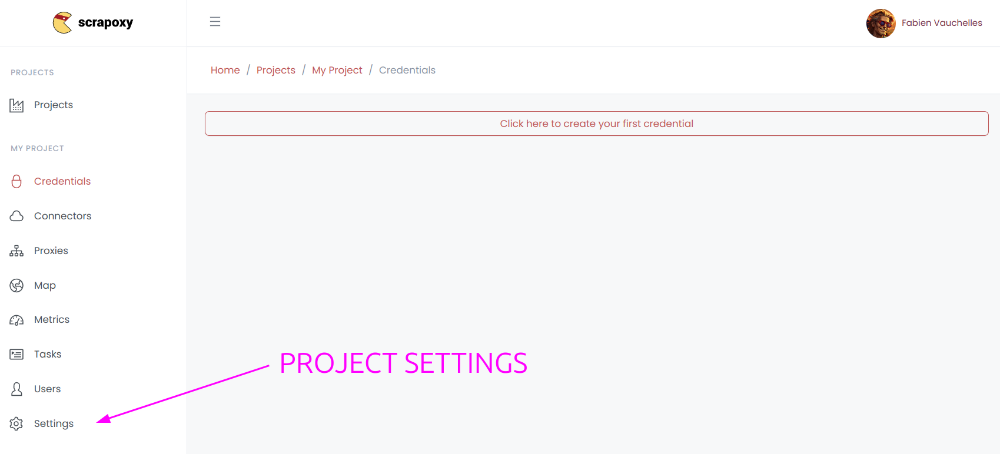

Settings can also be accessed through the left menu.

### List of projects

If you come back to the `Projects` section, Scrapoxy will display a list of all accessible projects.

## Marketplace

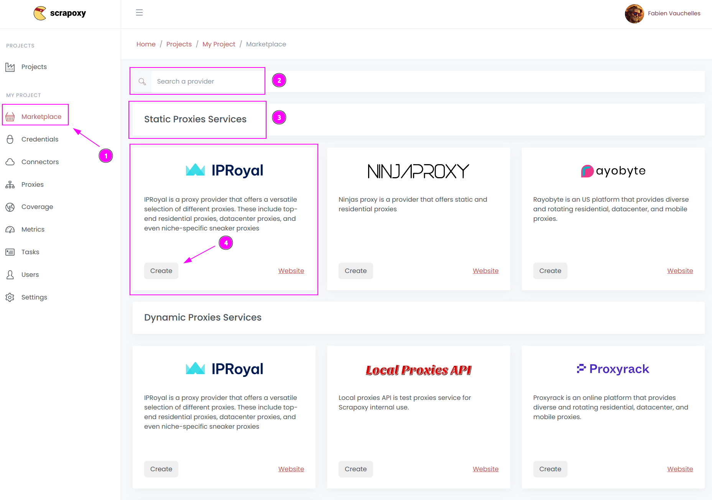

Upon the first connection:
1. Scrapoxy will redirect you to the `Marketplace` section;
2. Search for a provider by name or type;
3. Providers are categorized by type (e.g., datacenter provider, proxies services, etc.);
4. Click on `Create` to commence the configuration the chosen provider.

## Credentials

### Credential creation

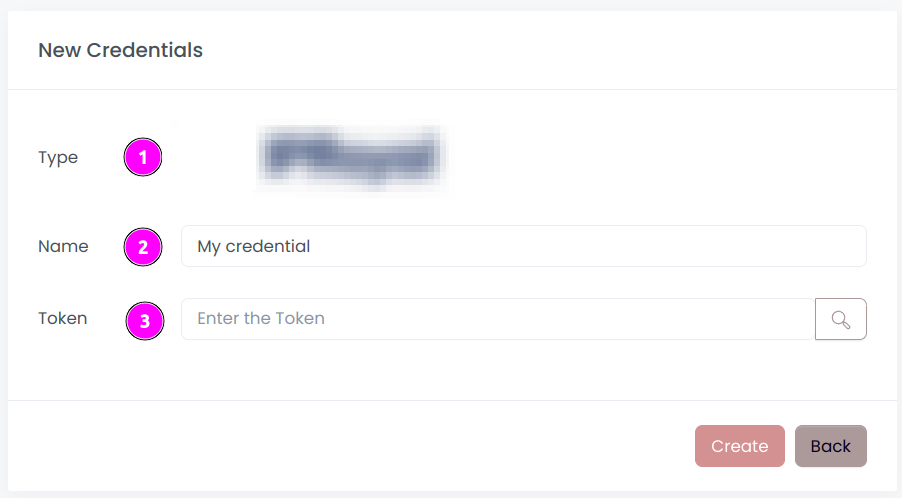

The settings for the connector's credential include:
1. **Type**: The provider of the credential;
2. **Name**: A unique name for the credential within the project;
3. **Options**: Configuration options for the credential, dependent on the type of provider.

::: info
When you save the settings, Scrapoxy performs a validation test to ensure that the entered credentials are valid.
:::

### List of credentials

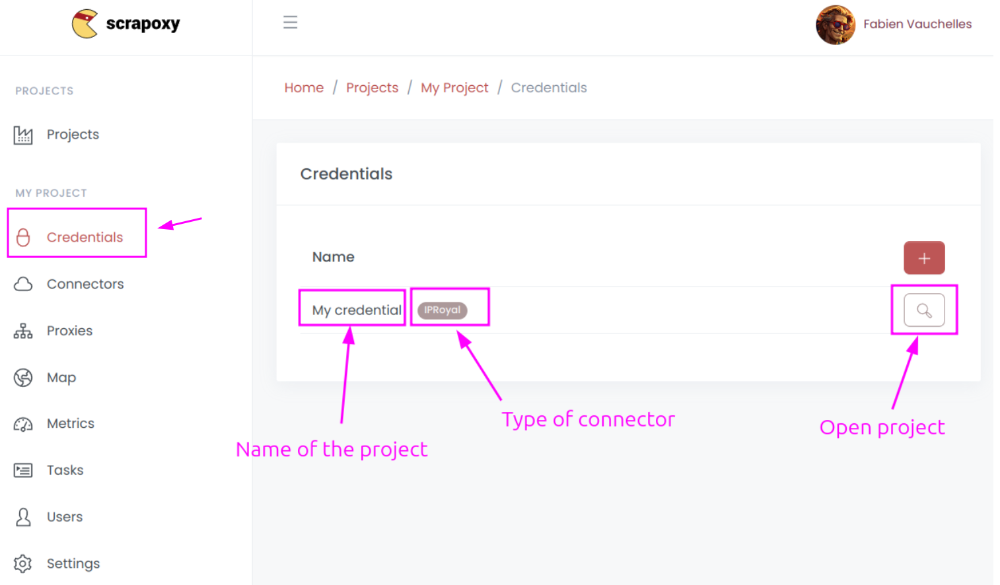

After saving, Scrapoxy will display the list of credentials.

### Credential update

If you open a credential, Scrapoxy displays the settings:

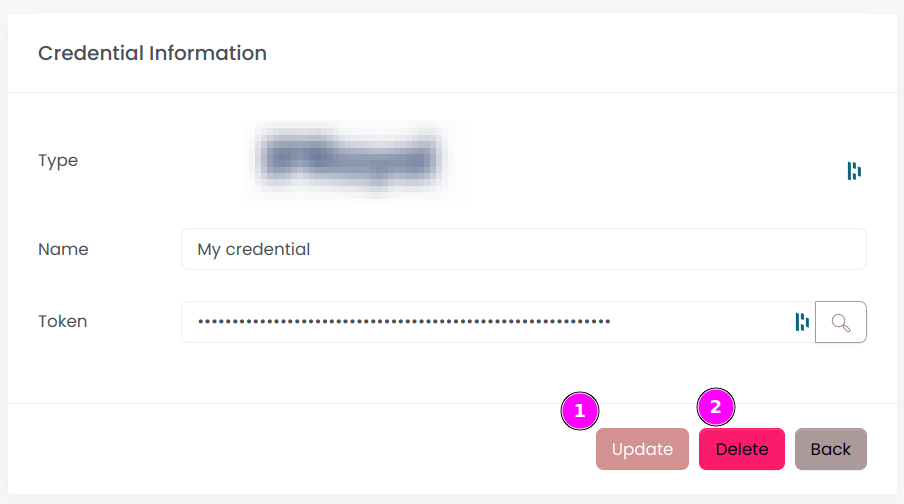

You have the following options when managing a credential:
1. **Update**: Modify the credential with new settings;
2. **Delete**: Remove the credential, provided there are no connectors currently using it.

## Connectors

### Connector creation

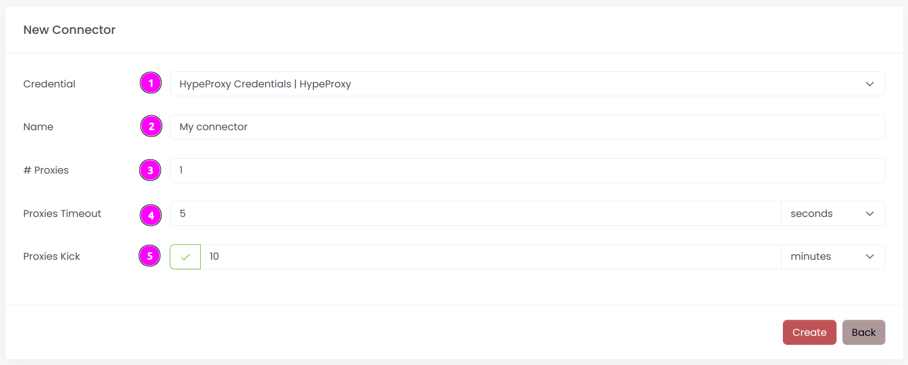

Upon the first connection, Scrapoxy will guide you through the creation of a new connector with the following settings:
1. **Credential**: Selection from the list of available credentials from the previous section;
2. **Name**: Unique identifier for the connector within the project;
3. **# of proxies**: Maximum number of proxies that the connector can provide and that you intend to use;
4. **Proxies Timeout**: Maximum duration for connecting to a proxy before considering it as offline;
5. **Proxies Kick**: If enabled, maximum duration for a proxy to be offline before being removed from the pool;

When you save the settings, Scrapoxy performs a validation test to ensure that the entered configuration is valid.

::: info
Proxies Kick must be greater than Proxies Timeout.
:::

### List of connectors

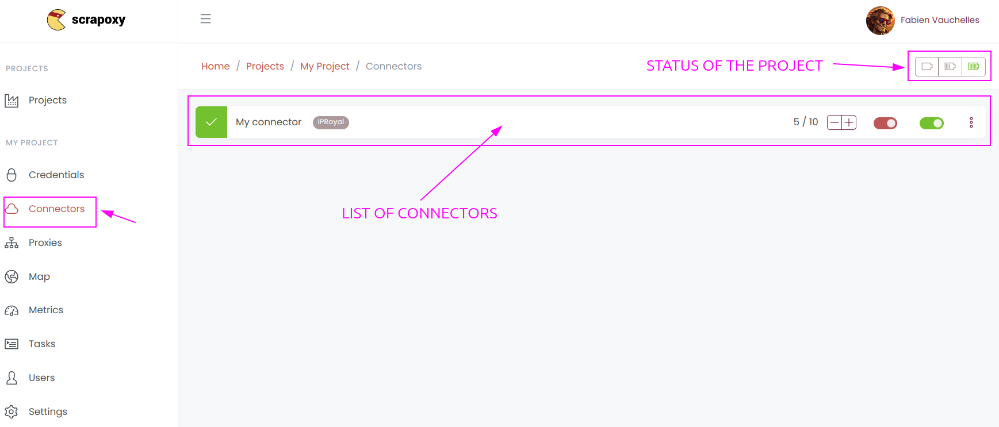

After saving, Scrapoxy will display the list of connectors.

### Connector update

If you open the connector, Scrapoxy will present the associated settings:

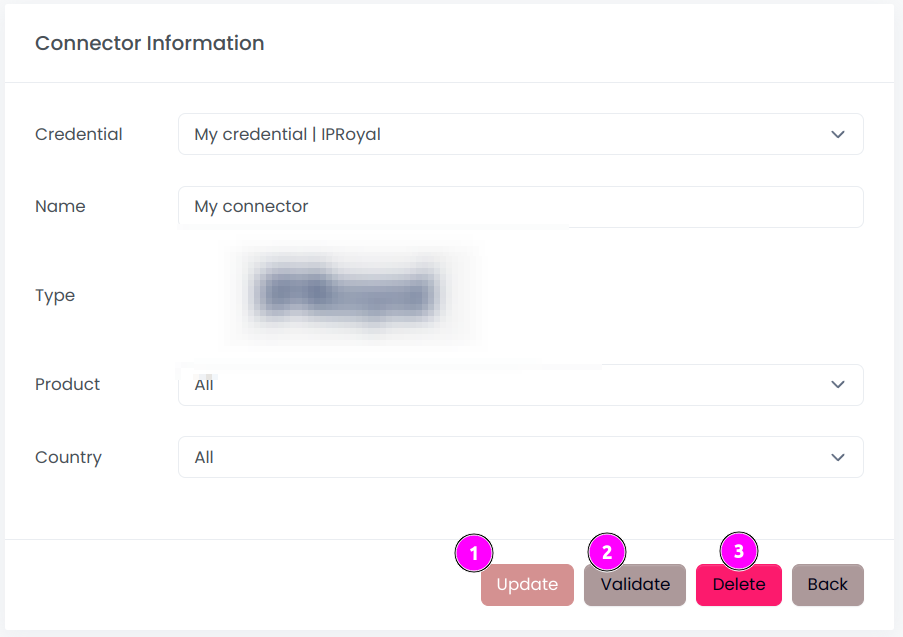

Upon opening the connector, Scrapoxy provides the following options:
1. **Update**: Modify the connector with new settings;
2. **Validate**: Confirm the validity of the connector configuration. Particularly useful for datacenter providers, as Scrapoxy checks for the existence of the template image;
3. **Delete**: Remove the connector only if the project's status is OFF.

::: info
The type cannot be modified.
:::

### Project status

The project can have the following statuses:

| Status | Description                                                                                                                                                                    |
|--------|--------------------------------------------------------------------------------------------------------------------------------------------------------------------------------|
| OFF | The project is stopped. All proxies are halted and removed.                                                                                                                    |
| CALM | The project is in a sleep state. It maintains the minimum required proxies according to the project's settings and awaits the initial request (if `Auto Scale Up` is enabled). |
| HOT | The project is active. All proxies are started and await connections.                                                                                                          |

### Connector details

A connector has:
1. **Status**: Indicates the current status of the connector (refer to the descriptions below);
2. **Name**: The unique identifier assigned to the connector;
3. **Type**: The classification of the connector, consistent with the credential type;
4. **Proxies count**: Displays the number of online proxies and the maximum allowed proxies for this connector;
5. **Proxies control**: Offers the option to increase or decrease the maximum number of proxies for this connector;
6. **Default**: If enabled, designates this connector as the exclusive one used when the project status is `CALM`. Only one connector can be set as the default for a project;
7. **Active**: If enabled, initiate the proxies associated with this connector;
8. **Options**: Provides a shortcut for scaling, updating, installing, or uninstalling the connector.

### Connector status

The connector can have the following statuses:

| Icon                                 | Status                                                        | Description                                             |
|--------------------------------------|---------------------------------------------------------------|---------------------------------------------------------|
|        | ON                                                            | The connector is online.                                |
|      | OFF                                                           | The connector is offline.                               |
|  | ERROR | The connector has an error. Details are in the tooltip. |

## Proxies

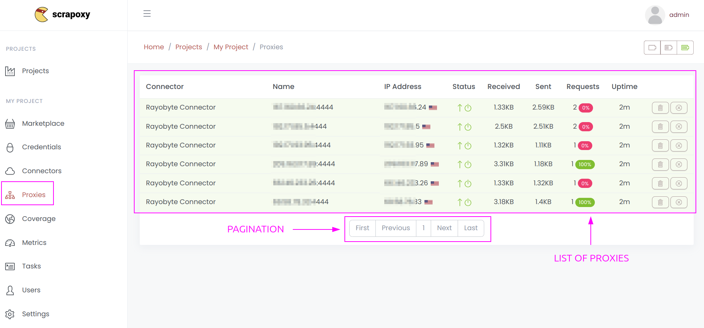

If you open the `Proxies` section, Scrapoxy will present a list of proxies.

This compilation includes proxies from all connectors, with pagination to enhance performance.

### Proxy details

A proxy is characterized by the following attributes:
1. **Connector**: The name of the associated connector;
2. **Name**: The identifier assigned to the proxy;
3. **IP Address**: The IP address of the proxy along with geo-localization information;
4. **Status**: Indicates the current status of the proxy (refer to the descriptions below);
5. **Received**: The amount of bytes received by the proxy;
6. **Sent**: The amount of bytes sent by the proxy;
7. **Requests**: The number of requests made by the proxy;
8. **Uptime**: The uptime of the proxy, representing the duration between its creation and the current moment;
9. **Delete**: Manually remove the proxy from the pool.

### Proxy status

The proxy has 2 sets of statuses:
- **Instance Status**: This reflects the overall operational status of the proxy;
- **Connection Status**: This denotes the status of the connection associated with the proxy.

#### Instance status

| Icon                                   | Status   | Description             |
|----------------------------------------|----------|-------------------------|
|  | STARTING | The proxy is starting.  |
|    | STARTED  | The proxy is started.   |
|  | STOPPING | The proxy is stopping.  |
|    | STOPPED  | The proxy is stopped.   |
|        | ERROR    | The proxy has an issue. |

#### Connection status

| Icon                                    | Status  | Description                  |
|-----------------------------------------|---------|------------------------------|
|  | ONLINE  | The connection is online.    |
|       | OFFLINE | The connection is offline.   |
|           | ERROR   | The connection has an issue. |

::: info
Scrapoxy will route traffic only when the proxy status is `STARTED` and connection is `ONLINE`.
:::

## Coverage

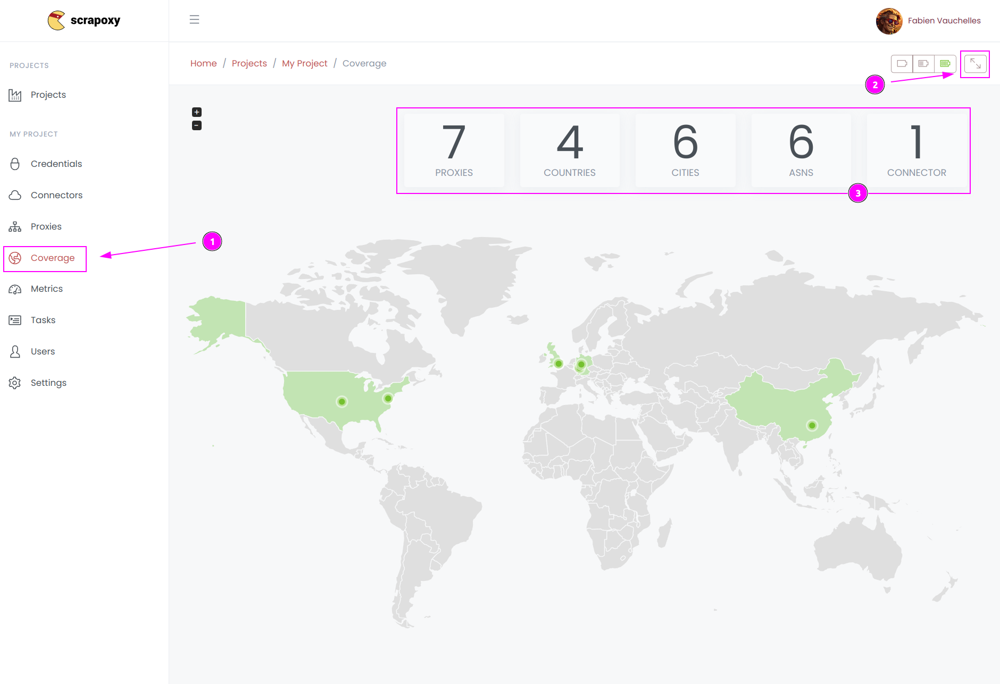

1. When you access the `Coverage` section, Scrapoxy presents a world map showcasing the locations of all proxies. This visualization aids in comprehending the geographic distribution of your proxies;
2. Scrapoxy furnishes metrics such as active proxies, countries, or cities;
3. Click on the full-screen icon to expand the map for a more detailed view.

Checking the origin of your proxies is valuable for optimizing your scraping performance.

::: info
The map displays only proxies that have been used **at least once**, allowing Scrapoxy to fingerprint them.
:::

---

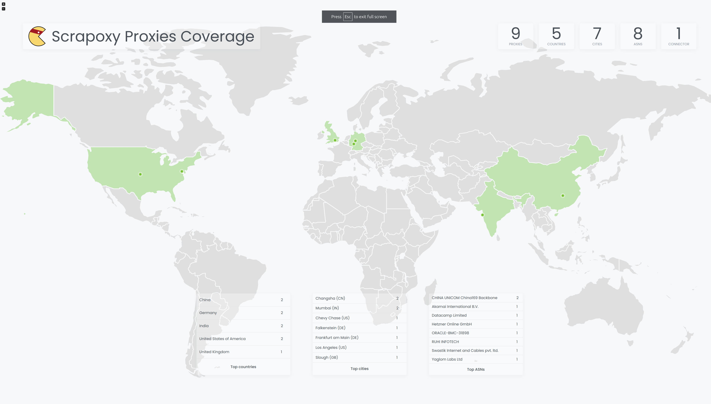

The fullscreen mode is tailored to optimize map display on a TV.
Additionally, it provides a ranking of top countries, cities, and ASNs (Autonomous System Numbers).

## Metrics

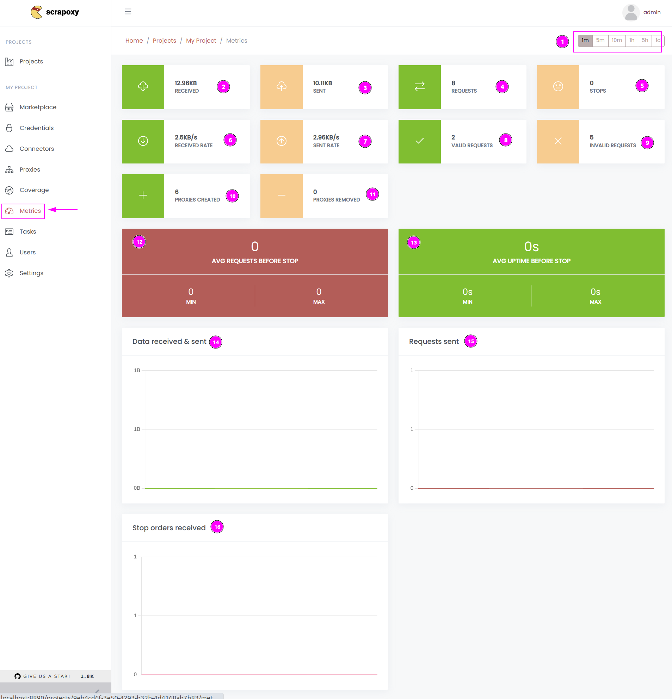

In the `Metrics` section, Scrapoxy provides a set of metrics for monitoring your project.
These metrics include:
1. **Range**: Adjusts the window of the metrics (e.g., 1 minute, 5 minutes);
2. **Received**: Total amount of bytes received by all proxies;
3. **Sent**: Total amount of bytes sent by all proxies;
4. **Received rate**: Current rate of data received by all proxies;
5. **Sent rate**: Current rate of data sent by all proxies;
6. **Requests**: Total number of requests made by all proxies;
7. **Stops**: Total number of "delete" delete orders;
8. **Proxies Created**: Total number of proxies created;
9. **Proxies Removed**: Total number of proxies deleted;
10. **Avg Requests Before Stop**: Average number of requests made by proxy before removal from the pool;
11. **Avg Uptime Before Stop**: Average uptime for a proxy before removal from the pool;
12. **Data received & sent**: Amount of data received and sent by all proxies over time;
13. **Requests sent**: Number of requests made by all proxies over time;
14. **Stop orders received**: Number of "stop" orders received over time.

::: info
Only the last 3 charts use the window setting.
:::

::: tip
- Line charts are valuable for monitoring project usage.
- By analyzing "stop" orders, you can determine how much time a proxy is utilized before removal from the pool.
:::

## Tasks

### List of tasks

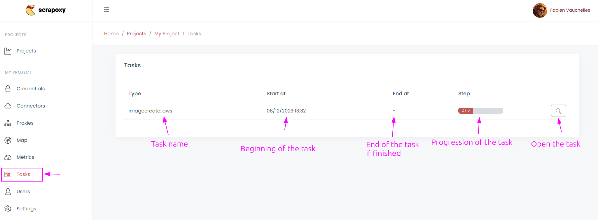

If you open the `Tasks` section, Scrapoxy displays a list of executed tasks.

### Task details

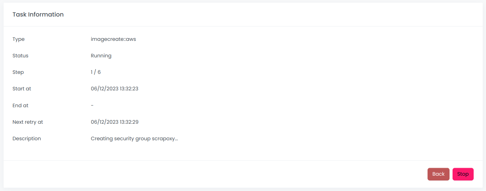

If you open a task, Scrapoxy presents detailed information about the task.

## Users

### List of users

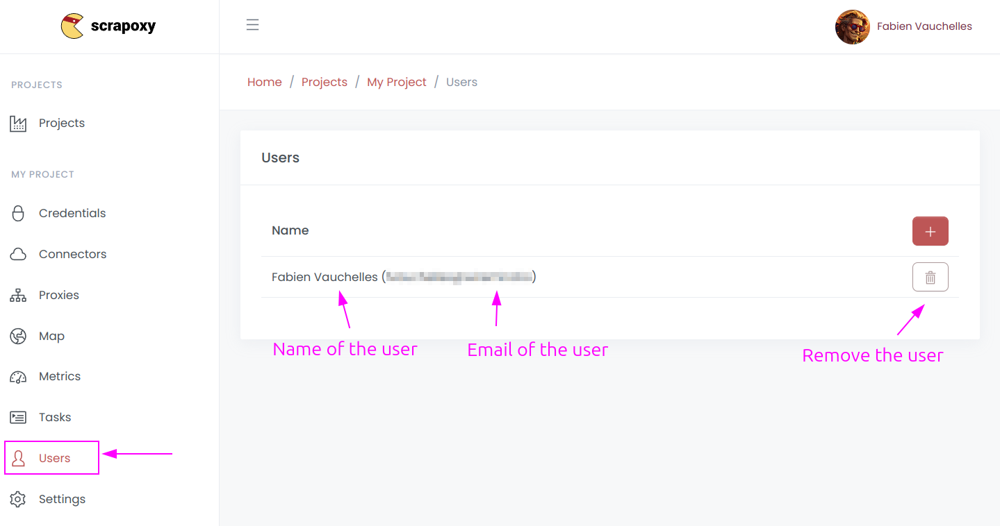

If you open the `Users` section, Scrapoxy displays the list of users authorized to access the project.

::: warning
1. You can only add users who have previously been authenticated by Scrapoxy.
2. It is impossible to remove yourself from the project.
:::
